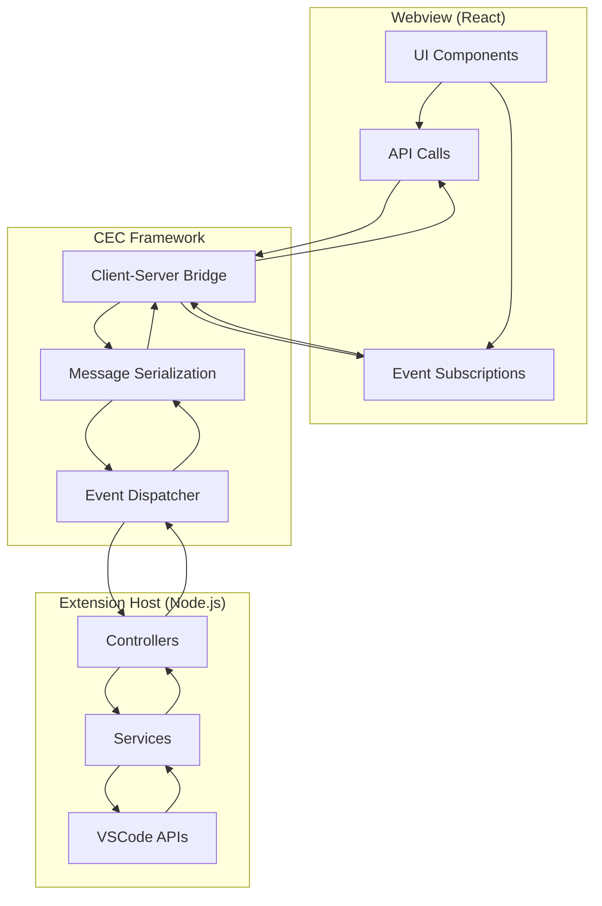
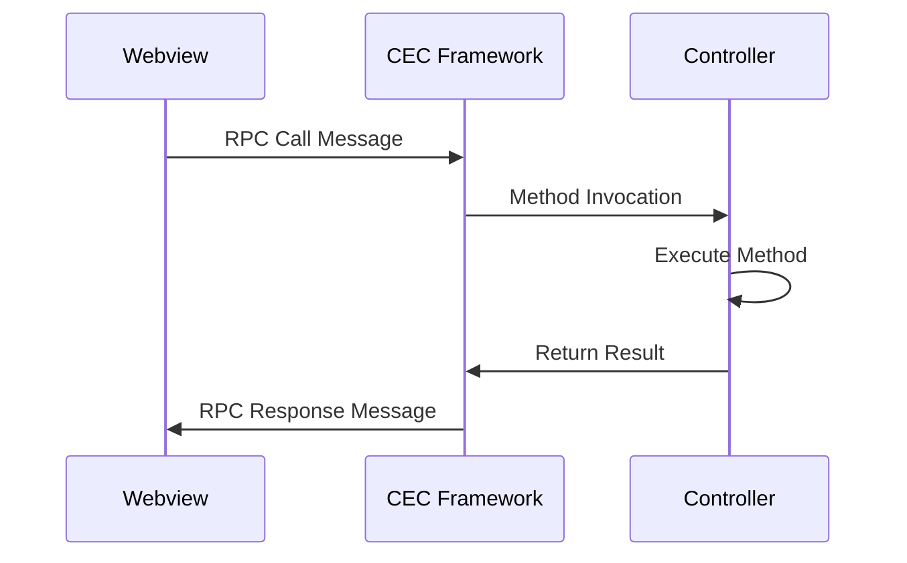
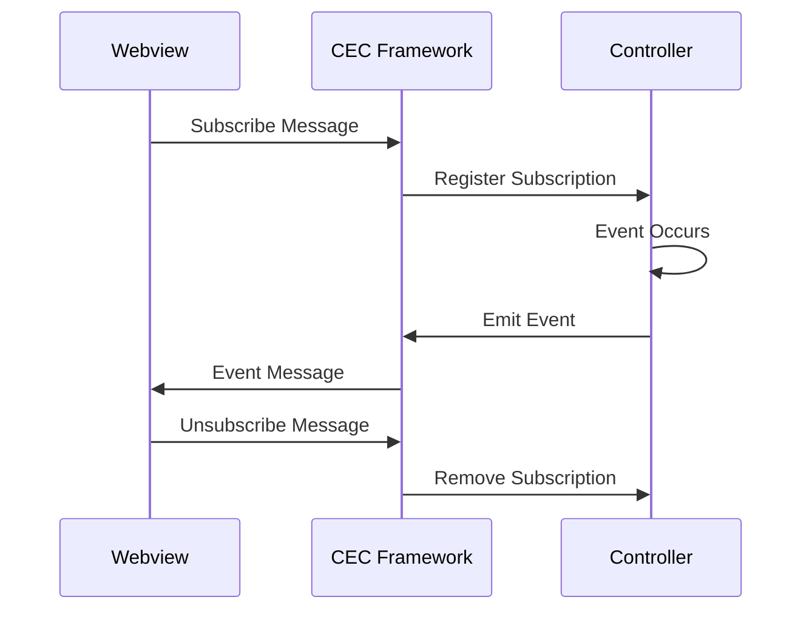

# 通信架构

## 架构概述

Happy Coding VSCode Extension 采用了基于 CEC Client-Server 框架的通信架构，实现了扩展主机 (Extension Host) 与 Webview 之间的高效双向通信。

## 通信框架 - CEC Client-Server

### 框架特性

#### 🔄 双向通信
- **RPC 调用**: Webview 可以调用扩展主机的方法
- **事件订阅**: Webview 可以订阅扩展主机的事件
- **异步处理**: 所有通信都是异步的，不阻塞 UI

#### 🎯 装饰器驱动
- **@controller**: 定义控制器类
- **@callable**: 定义可调用的方法
- **@subscribable**: 定义可订阅的事件

#### 🛡️ 类型安全
- **TypeScript 支持**: 完整的 TypeScript 类型定义
- **参数验证**: 自动验证方法参数类型
- **错误处理**: 统一的错误处理机制

### 通信模式



## 扩展主机端实现

### 控制器注册

#### 注册机制
```typescript
// src/extension.ts
import { registerControllers, registerServices } from "cec-client-server/decorator";

export function activate(context: vscode.ExtensionContext): void {
  // 1. 注册全局上下文
  ContextService.register(context);
  
  // 2. 注册控制器 (RPC 调用接口)
  registerControllers([
    GitController,
    AxiosController,
    UserController,
    CodingController,
    CliController,
    PlaywrightController,
  ]);
  
  // 3. 注册服务 (事件订阅接口)
  registerServices([CodingController]);
}
```

#### 控制器定义
```typescript
@controller("Coding")
export class CodingController {
  // RPC 方法定义
  @callable("start")
  async startCoding(params?: {
    maxGeneratedLines?: number;
    acceptRatio?: number;
  }) {
    // 方法实现
    return { success: true };
  }
  
  @callable("stop")
  async stopCoding(manualStop = true) {
    // 方法实现
  }
  
  // 事件订阅定义
  @subscribable("generationUpdates")
  generationUpdates(next: (data: any) => void) {
    this.subscribers.push(next);
    return () => {
      this.subscribers = this.subscribers.filter(cb => cb !== next);
    };
  }
  
  // 私有方法 - 事件发布
  private emitUpdate(data: any) {
    this.subscribers.forEach(cb => cb(data));
  }
}
```

### 装饰器详解

#### @controller 装饰器
```typescript
/**
 * 控制器装饰器
 * @param name 控制器名称，用于前端调用时的标识
 */
@controller("ControllerName")
export class MyController {
  // 控制器实现
}
```

#### @callable 装饰器
```typescript
/**
 * 可调用方法装饰器
 * @param methodName 方法名称，用于前端调用时的标识
 */
@callable("methodName")
async myMethod(param1: string, param2: number): Promise<any> {
  // 方法实现
  return result;
}
```

#### @subscribable 装饰器
```typescript
/**
 * 可订阅事件装饰器
 * @param eventName 事件名称，用于前端订阅时的标识
 */
@subscribable("eventName")
myEvent(next: (data: any) => void) {
  // 订阅逻辑
  this.subscribers.push(next);
  
  // 返回取消订阅函数
  return () => {
    this.subscribers = this.subscribers.filter(cb => cb !== next);
  };
}
```

## Webview 端实现

### 通信客户端

#### API 调用封装
```typescript
// utils/message.ts
export const vscodeApi = acquireVsCodeApi();

// RPC 调用封装
export async function call(
  controller: string, 
  method: string, 
  ...args: any[]
): Promise<any> {
  return new Promise((resolve, reject) => {
    const requestId = generateRequestId();
    
    // 发送请求
    vscodeApi.postMessage({
      type: 'rpc-call',
      controller,
      method,
      args,
      requestId
    });
    
    // 监听响应
    const handleMessage = (event: MessageEvent) => {
      const message = event.data;
      if (message.type === 'rpc-response' && message.requestId === requestId) {
        window.removeEventListener('message', handleMessage);
        
        if (message.error) {
          reject(new Error(message.error));
        } else {
          resolve(message.result);
        }
      }
    };
    
    window.addEventListener('message', handleMessage);
  });
}

// 事件订阅封装
export function subscribe(
  eventName: string, 
  callback: (data: any) => void
): () => void {
  const subscriptionId = generateSubscriptionId();
  
  // 发送订阅请求
  vscodeApi.postMessage({
    type: 'subscribe',
    eventName,
    subscriptionId
  });
  
  // 监听事件
  const handleMessage = (event: MessageEvent) => {
    const message = event.data;
    if (message.type === 'event' && 
        message.eventName === eventName && 
        message.subscriptionId === subscriptionId) {
      callback(message.data);
    }
  };
  
  window.addEventListener('message', handleMessage);
  
  // 返回取消订阅函数
  return () => {
    window.removeEventListener('message', handleMessage);
    vscodeApi.postMessage({
      type: 'unsubscribe',
      eventName,
      subscriptionId
    });
  };
}
```

### React Hook 集成

#### 自定义 Hook 实现
```typescript
// hooks/useCoding.ts
import { useState, useEffect } from 'react';
import { call, subscribe } from '../utils/message';

export const useCoding = () => {
  const [acceptDetails, setAcceptDetails] = useState([]);
  const [loading, setLoading] = useState(false);
  
  useEffect(() => {
    // 订阅生成更新事件
    const unsubscribeUpdates = subscribe('generationUpdates', (data) => {
      setAcceptDetails(data);
    });
    
    // 订阅状态更新事件
    const unsubscribeStatus = subscribe('generationStatus', (data) => {
      setLoading(data.loading);
    });
    
    return () => {
      unsubscribeUpdates();
      unsubscribeStatus();
    };
  }, []);
  
  // API 方法封装
  const startCoding = async (params) => {
    return await call('Coding', 'start', params);
  };
  
  const stopCoding = async () => {
    return await call('Coding', 'stop');
  };
  
  const scanFile = async () => {
    return await call('Coding', 'scanFile');
  };
  
  const openFile = async (filePath) => {
    return await call('Coding', 'openFile', filePath);
  };
  
  const deleteFile = async (filePath) => {
    return await call('Coding', 'deleteFile', filePath);
  };
  
  return {
    // 状态
    acceptDetails,
    loading,
    
    // 方法
    startCoding,
    stopCoding,
    scanFile,
    openFile,
    deleteFile,
  };
};
```

#### 组件中的使用
```typescript
// components/CodingPanel.tsx
import React from 'react';
import { useCoding } from '../hooks/useCoding';

const CodingPanel = () => {
  const {
    acceptDetails,
    loading,
    startCoding,
    stopCoding
  } = useCoding();
  
  const handleStart = async () => {
    try {
      const result = await startCoding({
        maxGeneratedLines: 1000,
        acceptRatio: 30
      });
      
      if (result.success) {
        console.log('Started successfully');
      }
    } catch (error) {
      console.error('Failed to start:', error);
    }
  };
  
  return (
    <div>
      <button onClick={handleStart} disabled={loading}>
        {loading ? '生成中...' : '开始生成'}
      </button>
      
      <button onClick={stopCoding} disabled={!loading}>
        停止生成
      </button>
      
      <div>
        {acceptDetails.map((detail, index) => (
          <div key={index}>
            {detail.content}
          </div>
        ))}
      </div>
    </div>
  );
};
```

## 消息协议

### 消息类型定义

#### RPC 调用消息
```typescript
interface RPCCallMessage {
  type: 'rpc-call';
  controller: string;    // 控制器名称
  method: string;        // 方法名称
  args: any[];          // 方法参数
  requestId: string;    // 请求 ID
}

interface RPCResponseMessage {
  type: 'rpc-response';
  requestId: string;    // 对应的请求 ID
  result?: any;         // 成功结果
  error?: string;       // 错误信息
}
```

#### 事件订阅消息
```typescript
interface SubscribeMessage {
  type: 'subscribe';
  eventName: string;      // 事件名称
  subscriptionId: string; // 订阅 ID
}

interface UnsubscribeMessage {
  type: 'unsubscribe';
  eventName: string;      // 事件名称
  subscriptionId: string; // 订阅 ID
}

interface EventMessage {
  type: 'event';
  eventName: string;      // 事件名称
  subscriptionId: string; // 订阅 ID
  data: any;             // 事件数据
}
```

### 消息流程

#### RPC 调用流程


#### 事件订阅流程


## 错误处理

### 错误类型

#### 通信错误
```typescript
enum CommunicationError {
  TIMEOUT = 'TIMEOUT',
  INVALID_CONTROLLER = 'INVALID_CONTROLLER',
  INVALID_METHOD = 'INVALID_METHOD',
  PARAMETER_ERROR = 'PARAMETER_ERROR',
  EXECUTION_ERROR = 'EXECUTION_ERROR'
}
```

#### 错误处理机制
```typescript
// 扩展主机端错误处理
@callable("methodWithError")
async methodWithError(param: string): Promise<any> {
  try {
    // 方法实现
    return result;
  } catch (error) {
    // 错误会被框架自动捕获并传递给前端
    throw new Error(`Method execution failed: ${error.message}`);
  }
}

// Webview 端错误处理
const handleApiCall = async () => {
  try {
    const result = await call('Controller', 'methodWithError', 'param');
    // 处理成功结果
  } catch (error) {
    // 处理错误
    console.error('API call failed:', error.message);
    showErrorMessage(error.message);
  }
};
```

### 超时处理

#### 请求超时配置
```typescript
const TIMEOUT_CONFIG = {
  DEFAULT: 5000,      // 默认超时 5 秒
  LONG_RUNNING: 30000, // 长时间运行任务 30 秒
  FILE_OPERATION: 10000 // 文件操作 10 秒
};

async function callWithTimeout(
  controller: string,
  method: string,
  args: any[],
  timeout: number = TIMEOUT_CONFIG.DEFAULT
): Promise<any> {
  return Promise.race([
    call(controller, method, ...args),
    new Promise((_, reject) => {
      setTimeout(() => {
        reject(new Error(`Request timeout after ${timeout}ms`));
      }, timeout);
    })
  ]);
}
```

## 性能优化

### 消息批处理

#### 批量 API 调用
```typescript
interface BatchCall {
  controller: string;
  method: string;
  args: any[];
  id: string;
}

async function batchCall(calls: BatchCall[]): Promise<Record<string, any>> {
  const results: Record<string, any> = {};
  
  // 并发执行多个调用
  const promises = calls.map(async (call) => {
    try {
      const result = await callWithTimeout(
        call.controller, 
        call.method, 
        call.args
      );
      results[call.id] = { success: true, data: result };
    } catch (error) {
      results[call.id] = { success: false, error: error.message };
    }
  });
  
  await Promise.all(promises);
  return results;
}
```

### 事件防抖

#### 高频事件处理
```typescript
function createDebouncedSubscription(
  eventName: string,
  callback: (data: any) => void,
  delay: number = 300
): () => void {
  let timeoutId: NodeJS.Timeout;
  
  const debouncedCallback = (data: any) => {
    clearTimeout(timeoutId);
    timeoutId = setTimeout(() => {
      callback(data);
    }, delay);
  };
  
  return subscribe(eventName, debouncedCallback);
}

// 使用示例
const unsubscribe = createDebouncedSubscription(
  'generationUpdates',
  (data) => {
    setAcceptDetails(data);
  },
  500 // 500ms 防抖
);
```

### 内存管理

#### 订阅清理
```typescript
// React Hook 中的订阅管理
const useSubscription = (eventName: string, callback: (data: any) => void) => {
  useEffect(() => {
    const unsubscribe = subscribe(eventName, callback);
    
    // 组件卸载时自动清理订阅
    return unsubscribe;
  }, [eventName, callback]);
};

// 全局订阅管理器
class SubscriptionManager {
  private subscriptions = new Map<string, () => void>();
  
  subscribe(key: string, eventName: string, callback: (data: any) => void) {
    // 清理已存在的订阅
    this.unsubscribe(key);
    
    // 创建新订阅
    const unsubscribe = subscribe(eventName, callback);
    this.subscriptions.set(key, unsubscribe);
  }
  
  unsubscribe(key: string) {
    const unsubscribe = this.subscriptions.get(key);
    if (unsubscribe) {
      unsubscribe();
      this.subscriptions.delete(key);
    }
  }
  
  clear() {
    this.subscriptions.forEach(unsubscribe => unsubscribe());
    this.subscriptions.clear();
  }
}
```

## 调试和监控

### 通信日志

#### 日志记录
```typescript
// 开发环境下的通信日志
const DEBUG = process.env.NODE_ENV === 'development';

function logCommunication(type: string, data: any) {
  if (DEBUG) {
    console.log(`[CEC] ${type}:`, data);
  }
}

// 在 call 函数中添加日志
export async function call(
  controller: string, 
  method: string, 
  ...args: any[]
): Promise<any> {
  logCommunication('RPC_CALL', { controller, method, args });
  
  const result = await performCall(controller, method, args);
  
  logCommunication('RPC_RESPONSE', { controller, method, result });
  
  return result;
}
```

### 性能监控

#### 调用时间统计
```typescript
class PerformanceMonitor {
  private callTimes = new Map<string, number[]>();
  
  recordCall(controller: string, method: string, duration: number) {
    const key = `${controller}.${method}`;
    const times = this.callTimes.get(key) || [];
    times.push(duration);
    
    // 只保留最近 100 次调用的时间
    if (times.length > 100) {
      times.shift();
    }
    
    this.callTimes.set(key, times);
  }
  
  getStats(controller: string, method: string) {
    const key = `${controller}.${method}`;
    const times = this.callTimes.get(key) || [];
    
    if (times.length === 0) {
      return null;
    }
    
    const avg = times.reduce((a, b) => a + b, 0) / times.length;
    const min = Math.min(...times);
    const max = Math.max(...times);
    
    return { avg, min, max, count: times.length };
  }
}

const monitor = new PerformanceMonitor();
```

---

*本文档详细描述了 Happy Coding VSCode Extension 的通信架构，包括 CEC Client-Server 框架的使用、消息协议、错误处理和性能优化等技术细节。*