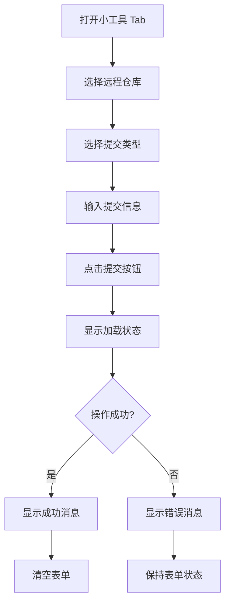
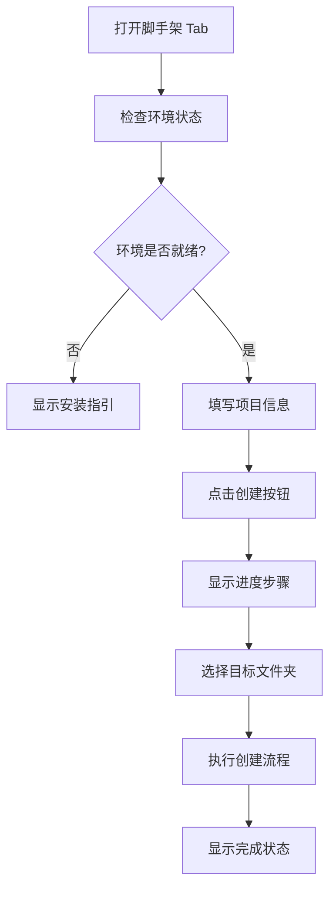

# 用户界面设计

## 设计概述

Happy Coding VSCode Extension 的用户界面采用现代化的设计理念，通过 React + Ant Design 构建了直观、美观、易用的操作界面。界面设计遵循 VSCode 的设计规范，确保与编辑器环境的完美融合。

## 整体布局结构

### 主界面架构

```
┌─────────────────────────────────────────┐
│  HAPPY Coding Extension Panel           │
├─────────────────────────────────────────┤
│  ┌─────┐ ┌─────────┐ ┌──────┐ [隐藏]    │
│  │小工具│ │ 脚手架  │ │ 脚本 │ │代码│   │
│  └─────┘ └─────────┘ └──────┘ └────┘   │
├─────────────────────────────────────────┤
│                                         │
│  [当前选中 Tab 的内容区域]               │
│                                         │
│  - Git 操作界面                         │
│  - 脚手架创建界面                       │
│  - 脚本执行界面                         │
│  - 代码生成控制界面 (隐藏功能)          │
│                                         │
└─────────────────────────────────────────┘
```

### 布局特点

#### 📱 响应式设计
- **自适应宽度**: 根据侧边栏宽度自动调整
- **紧凑布局**: 充分利用有限的空间
- **滚动支持**: 内容超出时支持垂直滚动

#### 🎨 视觉层次
- **清晰的标签页**: 使用卡片式标签页设计
- **内容分区**: 每个功能模块独立的内容区域
- **状态指示**: 明确的加载和状态指示

## 主题系统

### VSCode 主题适配

#### 自动主题检测
```typescript
const getTokenWithVscodeTheme = () => {
  // 获取 VSCode 编辑器背景色
  const bg = getComputedStyle(document.documentElement)
    .getPropertyValue("--vscode-editor-background")
    ?.trim() || "#212121";

  // 修改 Ant Design 基础 token
  const customSeed = {
    ...defaultSeed,
    colorBgBase: bg,
  };

  // 应用暗黑算法生成完整 token
  const mergedToken = getDesignToken({
    ...customSeed,
    algorithm: [darkAlgorithm],
  });

  return mergedToken;
};
```

#### 主题配置
```typescript
const App = () => {
  const token = useMemo(() => getTokenWithVscodeTheme(), []);
  
  return (
    <ConfigProvider
      componentSize="small"
      theme={{
        token: {
          ...token,
          fontSize: 12,
          size: "small",
        },
        components: {
          Tabs: {
            // 自定义 Tab 样式
          },
        },
      }}
    >
      {/* 应用内容 */}
    </ConfigProvider>
  );
};
```

### 颜色系统

#### 主色调
- **主背景色**: 继承 VSCode 编辑器背景色
- **文字颜色**: 继承 VSCode 前景色
- **边框颜色**: 继承 VSCode 边框色
- **强调色**: Ant Design 默认蓝色系

#### 状态颜色
```css
:root {
  --success-color: #52c41a;    /* 成功状态 */
  --warning-color: #faad14;    /* 警告状态 */
  --error-color: #ff4d4f;      /* 错误状态 */
  --info-color: #1890ff;       /* 信息状态 */
}
```

## 标签页设计

### 标签页结构

#### 主要标签页
```typescript
const tabItems = [
  {
    key: "GIT_TOOLS",
    label: <>小工具</>,
    children: <GitTab />,
  },
  {
    key: "CLI_TOOLS", 
    label: <>脚手架</>,
    children: <CliTab />,
  },
  {
    key: "SCRIPT_TOOLS",
    label: <>脚本</>,
    children: <ScriptTab />,
  },
];
```

#### 隐藏功能标签页
```typescript
// 代码生成功能 (隐藏)
if (barrageUnlocked) {
  tabItems.push({
    key: "BARRAGE",
    label: <>代码</>,
    children: <CodingBarragePanel {...props} />,
  });
}
```

### 隐藏功能机制

#### 解锁逻辑
```typescript
const handleSecretClick = () => {
  setClickCount((prev) => {
    const next = prev + 1;
    if (next >= 5) {
      const newUnlocked = !barrageUnlocked;
      setBarrageUnlocked(newUnlocked);
      vscodeApi.setState?.({ barrageUnlocked: newUnlocked });
      return 0; // 重置计数
    }
    return next;
  });
};

// 隐藏的触发区域
const extraContent = (
  <div
    style={{
      width: 36,
      height: 24,
      cursor: "pointer",
      opacity: 0, // 完全透明
    }}
    onClick={handleSecretClick}
  >
    <EyeInvisibleOutlined />
  </div>
);
```

#### 状态持久化
```typescript
// 初始状态从 VSCode 状态中读取
const [barrageUnlocked, setBarrageUnlocked] = useState(() => {
  const saved = vscodeApi.getState?.();
  return saved?.barrageUnlocked || false;
});

// 状态变更时保存
vscodeApi.setState?.({ barrageUnlocked: newUnlocked });
```

## 功能界面设计

### 1. Git 操作界面 (小工具 Tab)

#### 界面布局
```typescript
const GitTab = () => {
  return (
    <div className="git-tab">
      <Card title="Git 操作" size="small">
        <Space direction="vertical" style={{ width: '100%' }}>
          {/* 远程仓库选择 */}
          <div>
            <Text strong>远程仓库:</Text>
            <Select
              value={selectedRemote}
              onChange={setSelectedRemote}
              style={{ width: '100%' }}
              placeholder="选择远程仓库"
            >
              {remotes.map(remote => (
                <Option key={remote} value={remote}>
                  {remote}
                </Option>
              ))}
            </Select>
          </div>
          
          {/* 提交类型选择 */}
          <div>
            <Text strong>提交类型:</Text>
            <Select
              value={commitType}
              onChange={setCommitType}
              style={{ width: '100%' }}
            >
              {commitTypes.map(type => (
                <Option key={type.value} value={type.value}>
                  {type.label}
                </Option>
              ))}
            </Select>
          </div>
          
          {/* 提交信息输入 */}
          <div>
            <Text strong>提交信息:</Text>
            <Input.TextArea
              value={commitMessage}
              onChange={(e) => setCommitMessage(e.target.value)}
              placeholder="请输入提交信息..."
              rows={3}
            />
          </div>
          
          {/* 操作按钮 */}
          <Button
            type="primary"
            onClick={handleCommitAndPush}
            loading={loading}
            disabled={!commitMessage.trim() || !selectedRemote}
            block
          >
            提交并推送
          </Button>
        </Space>
      </Card>
    </div>
  );
};
```

#### 设计特点
- **表单式布局**: 清晰的表单结构，逐步引导用户操作
- **实时验证**: 按钮状态根据输入内容实时更新
- **视觉反馈**: 加载状态和操作结果的明确反馈

### 2. 脚手架界面 (脚手架 Tab)

#### 环境状态显示
```typescript
const EnvironmentStatus = ({ nodeStatus, cliStatus }) => {
  return (
    <Card title="环境状态" size="small">
      <Space direction="vertical" style={{ width: '100%' }}>
        {/* Node.js 状态 */}
        <div className="status-item">
          <Space>
            <Badge 
              status={nodeStatus.installed ? "success" : "error"} 
            />
            <Text>Node.js</Text>
            <Text type="secondary">
              {nodeStatus.version || "未安装"}
            </Text>
          </Space>
        </div>
        
        {/* CLI 工具状态 */}
        <div className="status-item">
          <Space>
            <Badge 
              status={cliStatus.installed ? "success" : "error"} 
            />
            <Text>Happy CLI</Text>
            <Text type="secondary">
              {cliStatus.version || "未安装"}
            </Text>
          </Space>
        </div>
      </Space>
    </Card>
  );
};
```

#### 项目创建表单
```typescript
const ProjectCreationForm = () => {
  return (
    <Card title="创建项目" size="small">
      <Form layout="vertical" onFinish={handleSubmit}>
        <Form.Item
          label="项目名称"
          name="name"
          rules={[{ required: true, message: '请输入项目名称' }]}
        >
          <Input placeholder="my-project" />
        </Form.Item>
        
        <Form.Item
          label="项目类型"
          name="type"
          rules={[{ required: true, message: '请选择项目类型' }]}
        >
          <Select placeholder="选择项目类型">
            <Option value="web">Web 应用</Option>
            <Option value="api">API 服务</Option>
            <Option value="mobile">移动应用</Option>
          </Select>
        </Form.Item>
        
        <Form.Item
          label="项目模板"
          name="template"
          rules={[{ required: true, message: '请选择项目模板' }]}
        >
          <Select placeholder="选择项目模板">
            <Option value="vue-ts">Vue + TypeScript</Option>
            <Option value="react-ts">React + TypeScript</Option>
            <Option value="express-ts">Express + TypeScript</Option>
          </Select>
        </Form.Item>
        
        <Form.Item>
          <Button type="primary" htmlType="submit" block>
            创建项目
          </Button>
        </Form.Item>
      </Form>
    </Card>
  );
};
```

#### 进度显示
```typescript
const CreationProgress = ({ steps, currentStep }) => {
  return (
    <Card title="创建进度" size="small">
      <Steps 
        current={currentStep} 
        direction="vertical" 
        size="small"
      >
        {steps.map(step => (
          <Step
            key={step.id}
            title={step.name}
            description={step.description}
            status={getStepStatus(step, currentStep)}
          />
        ))}
      </Steps>
    </Card>
  );
};
```

### 3. 代码生成界面 (隐藏功能)

#### 控制面板
```typescript
const ControlPanel = ({ onStart, onStop, loading }) => {
  return (
    <Card title="代码生成控制" size="small">
      <Space direction="vertical" style={{ width: '100%' }}>
        <Space>
          <Button 
            type="primary" 
            onClick={onStart}
            disabled={loading}
            icon={<PlayCircleOutlined />}
          >
            开始生成
          </Button>
          
          <Button 
            danger 
            onClick={onStop}
            disabled={!loading}
            icon={<PauseCircleOutlined />}
          >
            停止生成
          </Button>
        </Space>
        
        {loading && (
          <Progress 
            percent={0} 
            status="active" 
            showInfo={false}
          />
        )}
      </Space>
    </Card>
  );
};
```

#### 采纳日志表格
```typescript
const LogTable = ({ data }) => {
  const columns = [
    {
      title: '序号',
      dataIndex: 'count',
      key: 'count',
      width: 60,
    },
    {
      title: '内容',
      dataIndex: 'content',
      key: 'content',
      ellipsis: true,
      render: (text) => (
        <Tooltip title={text}>
          <Text code>{text}</Text>
        </Tooltip>
      ),
    },
    {
      title: '行数',
      key: 'lines',
      width: 80,
      render: (_, record) => (
        <Text type="secondary">
          {record.newLineCount - record.prevLineCount}
        </Text>
      ),
    },
  ];
  
  return (
    <Table
      columns={columns}
      dataSource={data}
      size="small"
      pagination={false}
      scroll={{ y: 300 }}
    />
  );
};
```

#### 文件管理表格
```typescript
const FileTable = ({ data, onOpen, onDelete, onRefresh }) => {
  const columns = [
    {
      title: '文件名',
      dataIndex: 'name',
      key: 'name',
      ellipsis: true,
    },
    {
      title: '操作',
      key: 'actions',
      width: 120,
      render: (_, record) => (
        <Space size="small">
          <Button 
            type="link" 
            size="small"
            onClick={() => onOpen(record)}
          >
            打开
          </Button>
          <Button 
            type="link" 
            size="small" 
            danger
            onClick={() => onDelete(record)}
          >
            删除
          </Button>
        </Space>
      ),
    },
  ];
  
  return (
    <div>
      <div style={{ marginBottom: 8 }}>
        <Button 
          size="small" 
          onClick={onRefresh}
          icon={<ReloadOutlined />}
        >
          刷新
        </Button>
      </div>
      
      <Table
        columns={columns}
        dataSource={data}
        size="small"
        pagination={false}
      />
    </div>
  );
};
```

## 交互设计

### 用户操作流程

#### Git 操作流程


#### 脚手架创建流程


### 状态管理

#### 加载状态
```typescript
const LoadingStates = {
  IDLE: 'idle',
  LOADING: 'loading',
  SUCCESS: 'success',
  ERROR: 'error'
};

const useAsyncOperation = () => {
  const [state, setState] = useState(LoadingStates.IDLE);
  const [error, setError] = useState(null);
  
  const execute = async (operation) => {
    setState(LoadingStates.LOADING);
    setError(null);
    
    try {
      const result = await operation();
      setState(LoadingStates.SUCCESS);
      return result;
    } catch (err) {
      setState(LoadingStates.ERROR);
      setError(err.message);
      throw err;
    }
  };
  
  return { state, error, execute };
};
```

#### 表单验证
```typescript
const useFormValidation = (rules) => {
  const [errors, setErrors] = useState({});
  
  const validate = (values) => {
    const newErrors = {};
    
    Object.keys(rules).forEach(field => {
      const rule = rules[field];
      const value = values[field];
      
      if (rule.required && !value) {
        newErrors[field] = rule.message || `${field} 是必填项`;
      }
      
      if (rule.pattern && value && !rule.pattern.test(value)) {
        newErrors[field] = rule.message || `${field} 格式不正确`;
      }
    });
    
    setErrors(newErrors);
    return Object.keys(newErrors).length === 0;
  };
  
  return { errors, validate };
};
```

## 响应式设计

### 布局适配

#### 容器尺寸适配
```css
.container {
  width: 100%;
  height: 100vh;
  overflow: hidden;
  display: flex;
  flex-direction: column;
}

.tab-content {
  flex: 1;
  overflow-y: auto;
  padding: 12px;
}

/* 小尺寸适配 */
@media (max-width: 300px) {
  .tab-content {
    padding: 8px;
  }
  
  .ant-card {
    margin-bottom: 8px;
  }
}
```

#### 组件尺寸适配
```typescript
const useResponsiveSize = () => {
  const [size, setSize] = useState('small');
  
  useEffect(() => {
    const updateSize = () => {
      const width = window.innerWidth;
      if (width < 300) {
        setSize('small');
      } else if (width < 500) {
        setSize('middle');
      } else {
        setSize('large');
      }
    };
    
    updateSize();
    window.addEventListener('resize', updateSize);
    
    return () => window.removeEventListener('resize', updateSize);
  }, []);
  
  return size;
};
```

## 可访问性设计

### 键盘导航

#### Tab 键导航
```typescript
const KeyboardNavigation = ({ children }) => {
  const handleKeyDown = (e) => {
    if (e.key === 'Tab') {
      // 确保 Tab 键导航正常工作
      const focusableElements = document.querySelectorAll(
        'button, input, select, textarea, [tabindex]:not([tabindex="-1"])'
      );
      
      // 处理焦点循环
      const firstElement = focusableElements[0];
      const lastElement = focusableElements[focusableElements.length - 1];
      
      if (e.shiftKey && document.activeElement === firstElement) {
        e.preventDefault();
        lastElement.focus();
      } else if (!e.shiftKey && document.activeElement === lastElement) {
        e.preventDefault();
        firstElement.focus();
      }
    }
  };
  
  return (
    <div onKeyDown={handleKeyDown}>
      {children}
    </div>
  );
};
```

### 屏幕阅读器支持

#### ARIA 标签
```typescript
const AccessibleButton = ({ children, loading, ...props }) => {
  return (
    <Button
      {...props}
      aria-label={loading ? '正在处理...' : props['aria-label']}
      aria-busy={loading}
      aria-disabled={props.disabled}
    >
      {children}
    </Button>
  );
};

const AccessibleForm = ({ children }) => {
  return (
    <form role="form" aria-label="项目创建表单">
      {children}
    </form>
  );
};
```

## 性能优化

### 虚拟滚动

#### 大数据列表优化
```typescript
const VirtualizedTable = ({ data, height = 300 }) => {
  const [visibleRange, setVisibleRange] = useState({ start: 0, end: 10 });
  const itemHeight = 32;
  
  const handleScroll = (e) => {
    const scrollTop = e.target.scrollTop;
    const start = Math.floor(scrollTop / itemHeight);
    const end = Math.min(start + Math.ceil(height / itemHeight), data.length);
    
    setVisibleRange({ start, end });
  };
  
  const visibleData = data.slice(visibleRange.start, visibleRange.end);
  
  return (
    <div 
      style={{ height, overflow: 'auto' }}
      onScroll={handleScroll}
    >
      <div style={{ height: data.length * itemHeight, position: 'relative' }}>
        <div 
          style={{ 
            transform: `translateY(${visibleRange.start * itemHeight}px)` 
          }}
        >
          {visibleData.map((item, index) => (
            <div key={visibleRange.start + index} style={{ height: itemHeight }}>
              {/* 渲染项目内容 */}
            </div>
          ))}
        </div>
      </div>
    </div>
  );
};
```

### 组件懒加载

#### 动态导入
```typescript
const LazyGitTab = lazy(() => import('./components/GitTab'));
const LazyCliTab = lazy(() => import('./components/CliTab'));
const LazyScriptTab = lazy(() => import('./components/ScriptTab'));

const App = () => {
  return (
    <Suspense fallback={<Spin />}>
      <Tabs>
        <TabPane key="git" tab="小工具">
          <LazyGitTab />
        </TabPane>
        <TabPane key="cli" tab="脚手架">
          <LazyCliTab />
        </TabPane>
        <TabPane key="script" tab="脚本">
          <LazyScriptTab />
        </TabPane>
      </Tabs>
    </Suspense>
  );
};
```

---

*本文档详细描述了 Happy Coding VSCode Extension 的用户界面设计，包括整体布局、主题系统、功能界面、交互设计、响应式设计和性能优化等方面的技术实现和设计理念。*