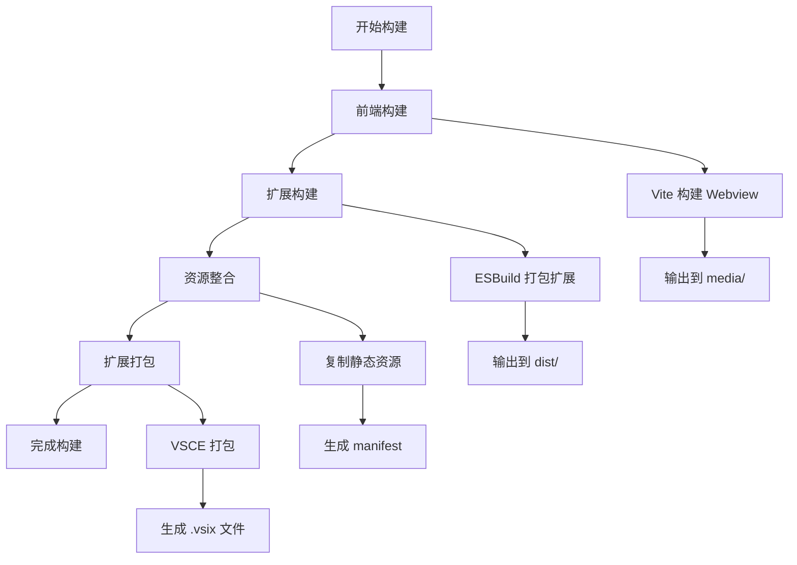

# 构建和部署

## 构建流程概述

Happy Coding VSCode Extension 采用多阶段构建流程，包括前端 Webview 构建、扩展代码打包和最终的扩展包生成。

## 构建架构

### 构建流程图



## 前端构建 (Webview)

### Vite 构建配置

#### 配置文件 (webview-side-bar/vite.config.ts)
```typescript
import { defineConfig } from 'vite';
import react from '@vitejs/plugin-react';
import path from 'path';

export default defineConfig({
  plugins: [react()],
  
  // 路径解析
  resolve: {
    alias: {
      '@': path.resolve(__dirname, './src'),
    },
  },
  
  // 构建配置
  build: {
    outDir: '../media',           // 输出到父目录的 media 文件夹
    emptyOutDir: true,            // 清空输出目录
    sourcemap: false,             // 生产环境不生成 sourcemap
    minify: 'terser',             // 使用 terser 压缩
    
    // Rollup 配置
    rollupOptions: {
      output: {
        // 文件命名规则
        entryFileNames: 'index.js',
        chunkFileNames: 'chunks/[name].[hash].js',
        assetFileNames: 'assets/[name].[hash].[ext]',
        
        // 手动分包
        manualChunks: {
          'react-vendor': ['react', 'react-dom'],
          'antd-vendor': ['antd', '@ant-design/icons'],
        },
      },
    },
    
    // 构建优化
    target: 'es2015',             // 目标环境
    cssCodeSplit: true,           // CSS 代码分割
    
    // 资源处理
    assetsInlineLimit: 4096,      // 小于 4KB 的资源内联
  },
  
  // 开发服务器配置
  server: {
    port: 3000,
    host: true,
    cors: true,
  },
  
  // CSS 预处理器
  css: {
    preprocessorOptions: {
      less: {
        javascriptEnabled: true,
      },
    },
  },
});
```

### 构建脚本

#### package.json 脚本
```json
{
  "scripts": {
    "dev": "vite",
    "build": "tsc && vite build",
    "preview": "vite preview",
    "lint": "eslint src --ext ts,tsx --report-unused-disable-directives --max-warnings 0",
    "type-check": "tsc --noEmit"
  }
}
```

#### 构建命令
```bash
# 开发模式
cd webview-side-bar
npm run dev

# 生产构建
cd webview-side-bar
npm run build

# 类型检查
npm run type-check

# 代码检查
npm run lint
```

### 构建优化

#### 代码分割策略
```typescript
// vite.config.ts - 手动分包配置
export default defineConfig({
  build: {
    rollupOptions: {
      output: {
        manualChunks: (id) => {
          // React 相关库
          if (id.includes('react') || id.includes('react-dom')) {
            return 'react-vendor';
          }
          
          // Ant Design 相关
          if (id.includes('antd') || id.includes('@ant-design')) {
            return 'antd-vendor';
          }
          
          // 工具库
          if (id.includes('lodash') || id.includes('dayjs')) {
            return 'utils-vendor';
          }
          
          // 业务组件
          if (id.includes('/src/components/')) {
            return 'components';
          }
          
          // 默认分包
          if (id.includes('node_modules')) {
            return 'vendor';
          }
        },
      },
    },
  },
});
```

#### 资源优化
```typescript
// 图片资源优化
import { defineConfig } from 'vite';
import { createSvgIconsPlugin } from 'vite-plugin-svg-icons';

export default defineConfig({
  plugins: [
    // SVG 图标优化
    createSvgIconsPlugin({
      iconDirs: [path.resolve(process.cwd(), 'src/assets/icons')],
      symbolId: 'icon-[dir]-[name]',
    }),
  ],
  
  build: {
    // 资源处理
    assetsInlineLimit: 4096,
    
    rollupOptions: {
      output: {
        assetFileNames: (assetInfo) => {
          const info = assetInfo.name.split('.');
          const ext = info[info.length - 1];
          
          // 根据文件类型分目录
          if (/\.(mp4|webm|ogg|mp3|wav|flac|aac)(\?.*)?$/i.test(assetInfo.name)) {
            return `media/[name].[hash][extname]`;
          }
          if (/\.(png|jpe?g|gif|svg)(\?.*)?$/i.test(assetInfo.name)) {
            return `images/[name].[hash][extname]`;
          }
          if (/\.(woff2?|eot|ttf|otf)(\?.*)?$/i.test(assetInfo.name)) {
            return `fonts/[name].[hash][extname]`;
          }
          
          return `assets/[name].[hash][extname]`;
        },
      },
    },
  },
});
```

## 扩展构建 (Extension Host)

### ESBuild 配置

#### 构建脚本
```typescript
// build/build-extension.js
const esbuild = require('esbuild');
const path = require('path');

const buildExtension = async () => {
  try {
    await esbuild.build({
      // 入口文件
      entryPoints: ['src/extension.ts'],
      
      // 输出配置
      outfile: 'dist/extension.js',
      bundle: true,
      
      // 平台配置
      platform: 'node',
      target: 'node14',
      
      // 外部依赖
      external: [
        'vscode',           // VSCode API
        'electron',         // Electron (如果使用)
      ],
      
      // 格式配置
      format: 'cjs',
      
      // 优化配置
      minify: true,
      sourcemap: false,
      treeShaking: true,
      
      // 路径解析
      tsconfig: 'tsconfig.json',
      
      // 插件配置
      plugins: [
        // 路径别名插件
        {
          name: 'alias',
          setup(build) {
            build.onResolve({ filter: /^@\// }, (args) => {
              return {
                path: path.resolve(__dirname, '../src', args.path.slice(2)),
              };
            });
          },
        },
      ],
      
      // 定义全局变量
      define: {
        'process.env.NODE_ENV': '"production"',
      },
    });
    
    console.log('✅ Extension build completed');
  } catch (error) {
    console.error('❌ Extension build failed:', error);
    process.exit(1);
  }
};

buildExtension();
```

#### TypeScript 编译配置
```json
{
  "compilerOptions": {
    "target": "ES2020",
    "lib": ["ES2020"],
    "module": "commonjs",
    "moduleResolution": "node",
    "outDir": "./dist",
    "rootDir": "./src",
    "strict": true,
    "esModuleInterop": true,
    "skipLibCheck": true,
    "forceConsistentCasingInFileNames": true,
    "experimentalDecorators": true,
    "emitDecoratorMetadata": true,
    "baseUrl": "./",
    "paths": {
      "@/*": ["src/*"]
    },
    "declaration": false,
    "sourceMap": false,
    "removeComments": true
  },
  "include": [
    "src/**/*"
  ],
  "exclude": [
    "node_modules",
    "dist",
    "webview-side-bar",
    "nest-server",
    "**/*.test.ts",
    "**/*.spec.ts"
  ]
}
```

### 构建脚本

#### 主项目构建脚本 (package.json)
```json
{
  "scripts": {
    "compile": "tsc -p .",
    "watch": "tsc -watch -p .",
    "build:webview": "cd webview-side-bar && npm install && npm run build",
    "build:extension": "node build/build-extension.js",
    "build": "npm run build:webview && npm run build:extension",
    "clean": "rimraf dist media",
    "prebuild": "npm run clean",
    "postbuild": "npm run copy-assets"
  }
}
```

#### 资源复制脚本
```javascript
// build/copy-assets.js
const fs = require('fs-extra');
const path = require('path');

const copyAssets = async () => {
  try {
    // 复制图标文件
    await fs.copy('icon.png', 'dist/icon.png');
    await fs.copy('panel.svg', 'dist/panel.svg');
    
    // 复制 package.json (用于扩展信息)
    const packageJson = await fs.readJson('package.json');
    const distPackageJson = {
      name: packageJson.name,
      version: packageJson.version,
      description: packageJson.description,
      main: './extension.js',
      engines: packageJson.engines,
      contributes: packageJson.contributes,
    };
    
    await fs.writeJson('dist/package.json', distPackageJson, { spaces: 2 });
    
    console.log('✅ Assets copied successfully');
  } catch (error) {
    console.error('❌ Failed to copy assets:', error);
    process.exit(1);
  }
};

copyAssets();
```

## 扩展打包

### VSCE 配置

#### .vscodeignore 文件
```
# 源代码
src/**
webview-side-bar/**
nest-server/**
script/**
build/**

# 开发文件
.vscode/**
.idea/**
.git/**
node_modules/**
*.log
*.map

# 测试文件
test/**
**/*.test.*
**/*.spec.*
playwright-report/**
test-results/**

# 配置文件
.eslintrc.*
.prettierrc.*
tsconfig.json
vite.config.ts
playwright.config.ts

# 文档
docs/**
README.md
CHANGELOG.md

# 其他
.DS_Store
Thumbs.db
```

#### 打包脚本
```json
{
  "scripts": {
    "package": "npm run build && vsce package",
    "onlyPackage": "vsce package",
    "publish": "npm run package && vsce publish",
    "prepackage": "npm run test",
    "postpackage": "echo 'Package created successfully'"
  }
}
```

### 版本管理

#### 自动版本更新
```javascript
// build/update-version.js
const fs = require('fs-extra');
const semver = require('semver');

const updateVersion = async (type = 'patch') => {
  try {
    const packageJson = await fs.readJson('package.json');
    const currentVersion = packageJson.version;
    const newVersion = semver.inc(currentVersion, type);
    
    // 更新 package.json
    packageJson.version = newVersion;
    await fs.writeJson('package.json', packageJson, { spaces: 2 });
    
    // 更新 CHANGELOG.md
    const changelog = await fs.readFile('CHANGELOG.md', 'utf8');
    const newChangelog = `# Changelog\n\n## [${newVersion}] - ${new Date().toISOString().split('T')[0]}\n\n### Added\n- \n\n### Changed\n- \n\n### Fixed\n- \n\n${changelog.replace('# Changelog\n\n', '')}`;
    
    await fs.writeFile('CHANGELOG.md', newChangelog);
    
    console.log(`✅ Version updated: ${currentVersion} → ${newVersion}`);
    return newVersion;
  } catch (error) {
    console.error('❌ Failed to update version:', error);
    process.exit(1);
  }
};

// 从命令行参数获取版本类型
const versionType = process.argv[2] || 'patch';
updateVersion(versionType);
```

## 持续集成 (CI/CD)

### GitHub Actions 配置

#### 构建工作流 (.github/workflows/build.yml)
```yaml
name: Build and Test

on:
  push:
    branches: [ main, develop ]
  pull_request:
    branches: [ main ]

jobs:
  build:
    runs-on: ubuntu-latest
    
    strategy:
      matrix:
        node-version: [16.x, 18.x, 20.x]
    
    steps:
    - name: Checkout code
      uses: actions/checkout@v3
    
    - name: Setup Node.js ${{ matrix.node-version }}
      uses: actions/setup-node@v3
      with:
        node-version: ${{ matrix.node-version }}
        cache: 'npm'
    
    - name: Install dependencies
      run: |
        npm ci
        cd webview-side-bar && npm ci
    
    - name: Run tests
      run: npm test
    
    - name: Build extension
      run: npm run build
    
    - name: Package extension
      run: npm run onlyPackage
    
    - name: Upload artifacts
      uses: actions/upload-artifact@v3
      with:
        name: extension-${{ matrix.node-version }}
        path: '*.vsix'
```

#### 发布工作流 (.github/workflows/release.yml)
```yaml
name: Release

on:
  push:
    tags:
      - 'v*'

jobs:
  release:
    runs-on: ubuntu-latest
    
    steps:
    - name: Checkout code
      uses: actions/checkout@v3
    
    - name: Setup Node.js
      uses: actions/setup-node@v3
      with:
        node-version: '18.x'
        cache: 'npm'
    
    - name: Install dependencies
      run: |
        npm ci
        cd webview-side-bar && npm ci
    
    - name: Run tests
      run: npm test
    
    - name: Build and package
      run: npm run package
    
    - name: Publish to VS Code Marketplace
      env:
        VSCE_PAT: ${{ secrets.VSCE_PAT }}
      run: npx vsce publish
    
    - name: Create GitHub Release
      uses: actions/create-release@v1
      env:
        GITHUB_TOKEN: ${{ secrets.GITHUB_TOKEN }}
      with:
        tag_name: ${{ github.ref }}
        release_name: Release ${{ github.ref }}
        draft: false
        prerelease: false
    
    - name: Upload Release Asset
      uses: actions/upload-release-asset@v1
      env:
        GITHUB_TOKEN: ${{ secrets.GITHUB_TOKEN }}
      with:
        upload_url: ${{ steps.create_release.outputs.upload_url }}
        asset_path: ./*.vsix
        asset_name: happy-coding-vscode-extension.vsix
        asset_content_type: application/zip
```

## 本地开发环境

### 开发脚本

#### 开发环境启动
```bash
#!/bin/bash
# scripts/dev.sh

echo "🚀 Starting development environment..."

# 启动前端开发服务器
echo "📦 Starting Webview development server..."
cd webview-side-bar
npm run dev &
WEBVIEW_PID=$!

# 监听扩展代码变化
echo "👀 Watching extension code..."
cd ..
npm run watch &
EXTENSION_PID=$!

# 等待用户中断
echo "✅ Development environment started"
echo "📝 Webview: http://localhost:3000"
echo "🔧 Extension: Watching for changes..."
echo "Press Ctrl+C to stop all processes"

# 清理函数
cleanup() {
  echo "🛑 Stopping development environment..."
  kill $WEBVIEW_PID 2>/dev/null
  kill $EXTENSION_PID 2>/dev/null
  exit 0
}

# 捕获中断信号
trap cleanup SIGINT SIGTERM

# 等待
wait
```

#### 测试脚本
```bash
#!/bin/bash
# scripts/test.sh

echo "🧪 Running tests..."

# 运行单元测试
echo "📋 Running unit tests..."
npm run test:unit

# 运行集成测试
echo "🔗 Running integration tests..."
npm run test:integration

# 运行 E2E 测试
echo "🎭 Running E2E tests..."
npm run test:e2e

echo "✅ All tests completed"
```

### 调试配置

#### VSCode 调试配置 (.vscode/launch.json)
```json
{
  "version": "0.2.0",
  "configurations": [
    {
      "name": "Run Extension",
      "type": "extensionHost",
      "request": "launch",
      "args": [
        "--extensionDevelopmentPath=${workspaceFolder}"
      ],
      "outFiles": [
        "${workspaceFolder}/dist/**/*.js"
      ],
      "preLaunchTask": "${workspaceFolder}:build"
    },
    {
      "name": "Debug Webview",
      "type": "chrome",
      "request": "launch",
      "url": "http://localhost:3000",
      "webRoot": "${workspaceFolder}/webview-side-bar/src",
      "sourceMaps": true
    }
  ]
}
```

#### 任务配置 (.vscode/tasks.json)
```json
{
  "version": "2.0.0",
  "tasks": [
    {
      "label": "build",
      "type": "shell",
      "command": "npm",
      "args": ["run", "build"],
      "group": "build",
      "presentation": {
        "echo": true,
        "reveal": "silent",
        "focus": false,
        "panel": "shared"
      },
      "problemMatcher": ["$tsc"]
    },
    {
      "label": "watch",
      "type": "shell",
      "command": "npm",
      "args": ["run", "watch"],
      "group": "build",
      "isBackground": true,
      "presentation": {
        "echo": true,
        "reveal": "silent",
        "focus": false,
        "panel": "shared"
      },
      "problemMatcher": ["$tsc-watch"]
    }
  ]
}
```

## 性能优化

### 构建性能优化

#### 并行构建
```javascript
// build/parallel-build.js
const { spawn } = require('child_process');
const path = require('path');

const runParallel = (commands) => {
  return Promise.all(
    commands.map(({ name, command, args, cwd }) => {
      return new Promise((resolve, reject) => {
        console.log(`🚀 Starting ${name}...`);
        
        const child = spawn(command, args, {
          cwd: cwd || process.cwd(),
          stdio: 'inherit',
          shell: true,
        });
        
        child.on('close', (code) => {
          if (code === 0) {
            console.log(`✅ ${name} completed`);
            resolve();
          } else {
            console.error(`❌ ${name} failed with code ${code}`);
            reject(new Error(`${name} failed`));
          }
        });
      });
    })
  );
};

// 并行执行构建任务
const buildTasks = [
  {
    name: 'Webview Build',
    command: 'npm',
    args: ['run', 'build'],
    cwd: 'webview-side-bar',
  },
  {
    name: 'Extension Build',
    command: 'npm',
    args: ['run', 'build:extension'],
  },
];

runParallel(buildTasks)
  .then(() => {
    console.log('🎉 All builds completed successfully');
  })
  .catch((error) => {
    console.error('💥 Build failed:', error);
    process.exit(1);
  });
```

#### 缓存优化
```javascript
// build/cache-config.js
const path = require('path');

const getCacheConfig = () => {
  const cacheDir = path.resolve(__dirname, '../.cache');
  
  return {
    // ESBuild 缓存
    esbuild: {
      cacheDir: path.join(cacheDir, 'esbuild'),
    },
    
    // TypeScript 缓存
    typescript: {
      incremental: true,
      tsBuildInfoFile: path.join(cacheDir, 'tsconfig.tsbuildinfo'),
    },
    
    // Vite 缓存
    vite: {
      cacheDir: path.join(cacheDir, 'vite'),
    },
  };
};

module.exports = { getCacheConfig };
```

## 部署策略

### 发布流程

#### 版本发布检查清单
```markdown
# 发布检查清单

## 代码质量
- [ ] 所有测试通过
- [ ] 代码审查完成
- [ ] 性能测试通过
- [ ] 安全扫描通过

## 文档更新
- [ ] README.md 更新
- [ ] CHANGELOG.md 更新
- [ ] API 文档更新
- [ ] 用户指南更新

## 构建验证
- [ ] 本地构建成功
- [ ] CI/CD 构建成功
- [ ] 扩展包大小合理
- [ ] 依赖项检查通过

## 发布准备
- [ ] 版本号更新
- [ ] 发布说明准备
- [ ] 市场截图更新
- [ ] 发布权限确认
```

#### 自动化发布脚本
```bash
#!/bin/bash
# scripts/release.sh

set -e

VERSION_TYPE=${1:-patch}
DRY_RUN=${2:-false}

echo "🚀 Starting release process..."
echo "📋 Version type: $VERSION_TYPE"
echo "🧪 Dry run: $DRY_RUN"

# 检查工作目录是否干净
if [[ -n $(git status --porcelain) ]]; then
  echo "❌ Working directory is not clean"
  exit 1
fi

# 运行测试
echo "🧪 Running tests..."
npm test

# 更新版本
echo "📝 Updating version..."
NEW_VERSION=$(node build/update-version.js $VERSION_TYPE)

# 构建项目
echo "🔨 Building project..."
npm run build

# 打包扩展
echo "📦 Packaging extension..."
npm run onlyPackage

if [[ "$DRY_RUN" == "true" ]]; then
  echo "🧪 Dry run completed successfully"
  echo "📋 Would release version: $NEW_VERSION"
  exit 0
fi

# 提交版本更新
echo "📤 Committing version update..."
git add package.json CHANGELOG.md
git commit -m "chore: bump version to $NEW_VERSION"
git tag "v$NEW_VERSION"

# 推送到远程
echo "🚀 Pushing to remote..."
git push origin main
git push origin "v$NEW_VERSION"

# 发布到市场
echo "🏪 Publishing to marketplace..."
npx vsce publish

echo "🎉 Release completed successfully!"
echo "📋 Version: $NEW_VERSION"
```

---

*本文档详细描述了 Happy Coding VSCode Extension 的完整构建和部署流程，包括前端构建、扩展打包、持续集成、性能优化和发布策略等方面的技术实现。*