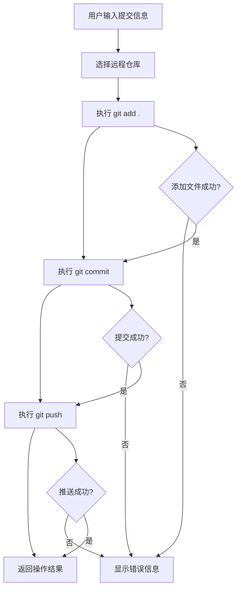

# Git 操作模块详解

## 模块概述

Git 操作模块 (GitController) 提供了可视化的版本控制功能，简化了常见的 Git 操作流程。通过集成 VSCode 的工作区 API 和 Node.js 的子进程功能，实现了直观的 Git 管理界面。

## 核心功能

### 📋 仓库信息管理

#### 远程仓库获取
- **自动检测**: 自动检测当前工作区的 Git 仓库
- **远程列表**: 获取所有配置的远程仓库信息
- **状态显示**: 在 UI 中显示仓库状态和信息

#### 技术实现
```typescript
@callable("getRemotesWithPath")
async getRemotesWithPath(): Promise<{ remotes: string[]; cwd: string }> {
  const folder = vscode.workspace.workspaceFolders?.[0];
  if (!folder) {
    return { remotes: [], cwd: "" };
  }
  
  const cwd = folder.uri.fsPath;
  
  return new Promise((resolve, reject) => {
    exec("git remote -v", { cwd }, (err, stdout) => {
      if (err) {
        console.error("获取远程仓库失败:", err);
        return reject(err);
      }
      
      // 解析命令输出，提取远程仓库名称
      const remotes = stdout
        .split("\n")
        .map(line => line.split("\t")[0])
        .filter(Boolean);
        
      resolve({ remotes, cwd });
    });
  });
}
```

#### 远程仓库信息解析
```typescript
interface RemoteInfo {
  name: string;      // 远程仓库名称 (origin, upstream, etc.)
  url: string;       // 仓库 URL
  type: 'fetch' | 'push'; // 操作类型
}

function parseRemoteOutput(output: string): RemoteInfo[] {
  const lines = output.split('\n').filter(line => line.trim());
  const remotes: RemoteInfo[] = [];
  
  for (const line of lines) {
    const match = line.match(/^(\S+)\s+(\S+)\s+\((\w+)\)$/);
    if (match) {
      const [, name, url, type] = match;
      remotes.push({
        name,
        url,
        type: type as 'fetch' | 'push'
      });
    }
  }
  
  return remotes;
}
```

### 🚀 快速提交和推送

#### 一键操作流程


#### 核心实现
```typescript
@callable("commitAndPush")
async commitAndPush(data: any): Promise<any> {
  const { selectedSst, commitMessage, remoteName } = data;
  const cwd = vscode.workspace.workspaceFolders?.[0].uri.fsPath;
  
  // 构建完整的提交信息
  const fullCommitMessage = `${selectedSst} msg:${commitMessage}`;
  
  // 执行 Git 命令序列
  const command = [
    'git add .',
    `git commit -m "${fullCommitMessage}"`,
    `git push ${remoteName} HEAD`
  ].join(' && ');
  
  return new Promise((resolve, reject) => {
    exec(command, { cwd }, (err, stdout, stderr) => {
      resolve({ 
        success: !err, 
        err: err ? stdout : stderr,
        output: stdout,
        command: command
      });
    });
  });
}
```

#### 提交信息格式化
```typescript
interface CommitData {
  selectedSst: string;    // 提交类型标签 (feat, fix, docs, etc.)
  commitMessage: string;  // 用户输入的提交信息
  remoteName: string;     // 目标远程仓库名称
}

function formatCommitMessage(data: CommitData): string {
  const { selectedSst, commitMessage } = data;
  
  // 支持多种提交信息格式
  const formats = {
    conventional: `${selectedSst}: ${commitMessage}`,
    prefixed: `${selectedSst} msg:${commitMessage}`,
    simple: commitMessage
  };
  
  // 默认使用 prefixed 格式
  return formats.prefixed;
}
```

### 🔄 工作区监听

#### 自动监听机制
```typescript
constructor() {
  // 监听工作区文件夹变更
  vscode.workspace.onDidChangeWorkspaceFolders(() => {
    const cwd = vscode.workspace.workspaceFolders?.[0]?.uri.fsPath || "";
    // 触发项目变更事件
    this.projectChange({ cwd });
  });
}
```

#### 项目变更事件
```typescript
@subscribable("projectChange")
projectChange(_payload?: { cwd?: string }) {
  // 不需要返回值；调用该方法即向所有订阅者广播
  console.log("发现项目更新了");
  
  // 可以在这里执行额外的逻辑
  // 例如：重新获取 Git 状态、更新 UI 等
}
```

#### 前端订阅处理
```typescript
// React Hook 中的订阅处理
const useGitStatus = () => {
  const [currentProject, setCurrentProject] = useState('');
  const [remotes, setRemotes] = useState([]);
  
  useEffect(() => {
    // 订阅项目变更事件
    const unsubscribe = subscribe('projectChange', async (data) => {
      console.log('Project changed:', data);
      
      // 重新获取远程仓库信息
      try {
        const result = await call('Git', 'getRemotesWithPath');
        setRemotes(result.remotes);
        setCurrentProject(result.cwd);
      } catch (error) {
        console.error('Failed to get remotes:', error);
        setRemotes([]);
        setCurrentProject('');
      }
    });
    
    return unsubscribe;
  }, []);
  
  return { currentProject, remotes };
};
```

## 高级功能

### 📊 Git 状态检查

#### 工作区状态获取
```typescript
@callable("getWorkspaceStatus")
async getWorkspaceStatus(): Promise<GitStatus> {
  const cwd = vscode.workspace.workspaceFolders?.[0]?.uri.fsPath;
  if (!cwd) {
    throw new Error('No workspace folder found');
  }
  
  return new Promise((resolve, reject) => {
    exec('git status --porcelain', { cwd }, (err, stdout) => {
      if (err) {
        return reject(err);
      }
      
      const status = parseGitStatus(stdout);
      resolve(status);
    });
  });
}

interface GitStatus {
  staged: string[];      // 已暂存的文件
  unstaged: string[];    // 未暂存的文件
  untracked: string[];   // 未跟踪的文件
  conflicted: string[];  // 冲突的文件
}

function parseGitStatus(output: string): GitStatus {
  const lines = output.split('\n').filter(line => line.trim());
  const status: GitStatus = {
    staged: [],
    unstaged: [],
    untracked: [],
    conflicted: []
  };
  
  for (const line of lines) {
    const statusCode = line.substring(0, 2);
    const filePath = line.substring(3);
    
    // 解析状态码
    if (statusCode.includes('U') || statusCode.includes('A') && statusCode.includes('A')) {
      status.conflicted.push(filePath);
    } else if (statusCode[0] !== ' ' && statusCode[0] !== '?') {
      status.staged.push(filePath);
    } else if (statusCode[1] !== ' ' && statusCode[1] !== '?') {
      status.unstaged.push(filePath);
    } else if (statusCode === '??') {
      status.untracked.push(filePath);
    }
  }
  
  return status;
}
```

### 🌿 分支管理

#### 分支信息获取
```typescript
@callable("getBranches")
async getBranches(): Promise<BranchInfo> {
  const cwd = vscode.workspace.workspaceFolders?.[0]?.uri.fsPath;
  if (!cwd) {
    throw new Error('No workspace folder found');
  }
  
  return new Promise((resolve, reject) => {
    exec('git branch -a', { cwd }, (err, stdout) => {
      if (err) {
        return reject(err);
      }
      
      const branches = parseBranchOutput(stdout);
      resolve(branches);
    });
  });
}

interface BranchInfo {
  current: string;       // 当前分支
  local: string[];       // 本地分支列表
  remote: string[];      // 远程分支列表
}

function parseBranchOutput(output: string): BranchInfo {
  const lines = output.split('\n').filter(line => line.trim());
  const branches: BranchInfo = {
    current: '',
    local: [],
    remote: []
  };
  
  for (const line of lines) {
    const trimmed = line.trim();
    
    if (trimmed.startsWith('* ')) {
      // 当前分支
      branches.current = trimmed.substring(2);
      branches.local.push(branches.current);
    } else if (trimmed.startsWith('remotes/')) {
      // 远程分支
      const remoteBranch = trimmed.substring(8); // 移除 'remotes/' 前缀
      branches.remote.push(remoteBranch);
    } else if (trimmed && !trimmed.startsWith('remotes/')) {
      // 本地分支
      branches.local.push(trimmed);
    }
  }
  
  return branches;
}
```

#### 分支切换
```typescript
@callable("switchBranch")
async switchBranch(branchName: string): Promise<{ success: boolean; message: string }> {
  const cwd = vscode.workspace.workspaceFolders?.[0]?.uri.fsPath;
  if (!cwd) {
    throw new Error('No workspace folder found');
  }
  
  return new Promise((resolve) => {
    exec(`git checkout ${branchName}`, { cwd }, (err, stdout, stderr) => {
      if (err) {
        resolve({
          success: false,
          message: stderr || err.message
        });
      } else {
        resolve({
          success: true,
          message: `Successfully switched to branch '${branchName}'`
        });
      }
    });
  });
}
```

### 📝 提交历史

#### 获取提交历史
```typescript
@callable("getCommitHistory")
async getCommitHistory(limit: number = 10): Promise<CommitInfo[]> {
  const cwd = vscode.workspace.workspaceFolders?.[0]?.uri.fsPath;
  if (!cwd) {
    throw new Error('No workspace folder found');
  }
  
  const format = '--pretty=format:"%H|%an|%ae|%ad|%s" --date=iso';
  const command = `git log ${format} -${limit}`;
  
  return new Promise((resolve, reject) => {
    exec(command, { cwd }, (err, stdout) => {
      if (err) {
        return reject(err);
      }
      
      const commits = parseCommitHistory(stdout);
      resolve(commits);
    });
  });
}

interface CommitInfo {
  hash: string;          // 提交哈希
  author: string;        // 作者姓名
  email: string;         // 作者邮箱
  date: string;          // 提交日期
  message: string;       // 提交信息
}

function parseCommitHistory(output: string): CommitInfo[] {
  const lines = output.split('\n').filter(line => line.trim());
  const commits: CommitInfo[] = [];
  
  for (const line of lines) {
    const parts = line.split('|');
    if (parts.length === 5) {
      commits.push({
        hash: parts[0],
        author: parts[1],
        email: parts[2],
        date: parts[3],
        message: parts[4]
      });
    }
  }
  
  return commits;
}
```

## 用户界面集成

### React 组件实现

#### Git 操作面板
```typescript
const GitTab = () => {
  const [remotes, setRemotes] = useState<string[]>([]);
  const [selectedRemote, setSelectedRemote] = useState<string>('');
  const [commitMessage, setCommitMessage] = useState<string>('');
  const [commitType, setCommitType] = useState<string>('feat');
  const [loading, setLoading] = useState<boolean>(false);
  
  // 提交类型选项
  const commitTypes = [
    { value: 'feat', label: '✨ 新功能' },
    { value: 'fix', label: '🐛 修复' },
    { value: 'docs', label: '📝 文档' },
    { value: 'style', label: '💄 样式' },
    { value: 'refactor', label: '♻️ 重构' },
    { value: 'test', label: '✅ 测试' },
    { value: 'chore', label: '🔧 构建' }
  ];
  
  // 获取远程仓库列表
  useEffect(() => {
    const fetchRemotes = async () => {
      try {
        const result = await call('Git', 'getRemotesWithPath');
        setRemotes(result.remotes);
        if (result.remotes.length > 0) {
          setSelectedRemote(result.remotes[0]);
        }
      } catch (error) {
        console.error('Failed to fetch remotes:', error);
      }
    };
    
    fetchRemotes();
    
    // 订阅项目变更
    const unsubscribe = subscribe('projectChange', fetchRemotes);
    return unsubscribe;
  }, []);
  
  // 提交和推送
  const handleCommitAndPush = async () => {
    if (!commitMessage.trim()) {
      message.error('请输入提交信息');
      return;
    }
    
    if (!selectedRemote) {
      message.error('请选择远程仓库');
      return;
    }
    
    setLoading(true);
    
    try {
      const result = await call('Git', 'commitAndPush', {
        selectedSst: commitType,
        commitMessage: commitMessage.trim(),
        remoteName: selectedRemote
      });
      
      if (result.success) {
        message.success('提交并推送成功');
        setCommitMessage('');
      } else {
        message.error(`操作失败: ${result.err}`);
      }
    } catch (error) {
      message.error(`操作失败: ${error.message}`);
    } finally {
      setLoading(false);
    }
  };
  
  return (
    <div className="git-tab">
      <Card title="Git 操作" size="small">
        <Space direction="vertical" style={{ width: '100%' }}>
          {/* 远程仓库选择 */}
          <div>
            <label>远程仓库:</label>
            <Select
              value={selectedRemote}
              onChange={setSelectedRemote}
              style={{ width: '100%' }}
              placeholder="选择远程仓库"
            >
              {remotes.map(remote => (
                <Option key={remote} value={remote}>
                  {remote}
                </Option>
              ))}
            </Select>
          </div>
          
          {/* 提交类型选择 */}
          <div>
            <label>提交类型:</label>
            <Select
              value={commitType}
              onChange={setCommitType}
              style={{ width: '100%' }}
            >
              {commitTypes.map(type => (
                <Option key={type.value} value={type.value}>
                  {type.label}
                </Option>
              ))}
            </Select>
          </div>
          
          {/* 提交信息输入 */}
          <div>
            <label>提交信息:</label>
            <Input.TextArea
              value={commitMessage}
              onChange={(e) => setCommitMessage(e.target.value)}
              placeholder="请输入提交信息..."
              rows={3}
            />
          </div>
          
          {/* 操作按钮 */}
          <Button
            type="primary"
            onClick={handleCommitAndPush}
            loading={loading}
            disabled={!commitMessage.trim() || !selectedRemote}
            block
          >
            提交并推送
          </Button>
        </Space>
      </Card>
    </div>
  );
};
```

## 错误处理和用户体验

### 错误类型定义
```typescript
enum GitErrorType {
  NO_REPOSITORY = 'NO_REPOSITORY',
  NO_REMOTES = 'NO_REMOTES',
  COMMIT_FAILED = 'COMMIT_FAILED',
  PUSH_FAILED = 'PUSH_FAILED',
  NETWORK_ERROR = 'NETWORK_ERROR',
  PERMISSION_DENIED = 'PERMISSION_DENIED',
  MERGE_CONFLICT = 'MERGE_CONFLICT'
}

class GitError extends Error {
  constructor(
    public type: GitErrorType,
    message: string,
    public details?: any
  ) {
    super(message);
    this.name = 'GitError';
  }
}
```

### 智能错误处理
```typescript
function handleGitError(error: any): GitError {
  const errorMessage = error.message || error.toString();
  
  // 根据错误信息判断错误类型
  if (errorMessage.includes('not a git repository')) {
    return new GitError(
      GitErrorType.NO_REPOSITORY,
      '当前目录不是 Git 仓库',
      { suggestion: '请在 Git 仓库中使用此功能' }
    );
  }
  
  if (errorMessage.includes('no upstream branch')) {
    return new GitError(
      GitErrorType.PUSH_FAILED,
      '没有设置上游分支',
      { suggestion: '请先设置上游分支或指定推送目标' }
    );
  }
  
  if (errorMessage.includes('Permission denied')) {
    return new GitError(
      GitErrorType.PERMISSION_DENIED,
      '权限被拒绝',
      { suggestion: '请检查 SSH 密钥或访问权限' }
    );
  }
  
  if (errorMessage.includes('CONFLICT')) {
    return new GitError(
      GitErrorType.MERGE_CONFLICT,
      '存在合并冲突',
      { suggestion: '请解决冲突后再次提交' }
    );
  }
  
  // 默认错误
  return new GitError(
    GitErrorType.COMMIT_FAILED,
    errorMessage,
    { originalError: error }
  );
}
```

### 用户友好的错误提示
```typescript
function showGitErrorMessage(error: GitError): void {
  const actions: vscode.MessageItem[] = [];
  
  switch (error.type) {
    case GitErrorType.NO_REPOSITORY:
      actions.push({ title: '初始化 Git 仓库' });
      break;
      
    case GitErrorType.PERMISSION_DENIED:
      actions.push({ title: '查看帮助文档' });
      break;
      
    case GitErrorType.MERGE_CONFLICT:
      actions.push({ title: '打开冲突文件' });
      break;
  }
  
  vscode.window.showErrorMessage(
    error.message,
    ...actions
  ).then(selection => {
    if (selection) {
      handleErrorAction(error.type, selection.title);
    }
  });
}

async function handleErrorAction(errorType: GitErrorType, action: string): Promise<void> {
  switch (errorType) {
    case GitErrorType.NO_REPOSITORY:
      if (action === '初始化 Git 仓库') {
        await vscode.commands.executeCommand('git.init');
      }
      break;
      
    case GitErrorType.PERMISSION_DENIED:
      if (action === '查看帮助文档') {
        vscode.env.openExternal(vscode.Uri.parse('https://docs.github.com/en/authentication'));
      }
      break;
      
    case GitErrorType.MERGE_CONFLICT:
      if (action === '打开冲突文件') {
        await vscode.commands.executeCommand('git.openChange');
      }
      break;
  }
}
```

## 性能优化

### 命令缓存
```typescript
class GitCommandCache {
  private cache = new Map<string, { data: any; timestamp: number }>();
  private readonly TTL = 30000; // 30秒缓存时间
  
  get(key: string): any | null {
    const cached = this.cache.get(key);
    if (!cached) return null;
    
    if (Date.now() - cached.timestamp > this.TTL) {
      this.cache.delete(key);
      return null;
    }
    
    return cached.data;
  }
  
  set(key: string, data: any): void {
    this.cache.set(key, {
      data,
      timestamp: Date.now()
    });
  }
  
  clear(): void {
    this.cache.clear();
  }
}

const gitCache = new GitCommandCache();
```

### 批量操作优化
```typescript
@callable("batchGitOperations")
async batchGitOperations(operations: GitOperation[]): Promise<BatchResult> {
  const results: OperationResult[] = [];
  const cwd = vscode.workspace.workspaceFolders?.[0]?.uri.fsPath;
  
  if (!cwd) {
    throw new Error('No workspace folder found');
  }
  
  // 批量执行操作，减少进程创建开销
  const commands = operations.map(op => op.command).join(' && ');
  
  return new Promise((resolve) => {
    exec(commands, { cwd }, (err, stdout, stderr) => {
      // 解析批量操作结果
      const batchResult = parseBatchResult(stdout, stderr, operations);
      resolve(batchResult);
    });
  });
}
```

---

*本文档详细描述了 Git 操作模块的完整实现，包括仓库管理、提交推送、分支操作、错误处理等核心功能的技术细节和最佳实践。*