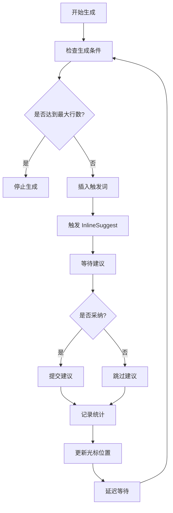

# 智能代码生成模块详解

## 模块概述

智能代码生成模块 (CodingController) 是 Happy Coding VSCode Extension 的核心功能，它基于 VSCode 的 InlineSuggest API 实现了自动化的代码生成和智能采纳机制。

## 核心功能

### 🤖 自动代码生成

#### 生成机制
- **基于 InlineSuggest**: 利用 VSCode 内置的代码建议功能
- **循环触发**: 持续循环触发代码建议，实现连续生成
- **智能触发词**: 在适当时机插入触发词以获得更好的建议质量

#### 生成流程


### 📊 智能采纳策略

#### 采纳算法
```typescript
// 核心采纳决策算法
const currentLineCount = editor.document.lineCount;
const generatedRatio = this.acceptedCount / currentLineCount;
const shouldAccept = Math.random() < this.acceptRatio / 100 - generatedRatio;
```

#### 策略说明
- **基础采纳率**: 用户配置的采纳百分比 (默认 30%)
- **动态调整**: 根据当前已采纳比例动态调整采纳概率
- **随机性**: 引入随机因子，避免过于规律的采纳模式
- **平衡机制**: 确保最终采纳率接近目标设定值

### 🔄 循环控制机制

#### 循环参数
```typescript
class CodingController {
  private loopCounter: number = 0;        // 循环计数器
  private snippetInterval: number = 10;   // 触发词插入间隔
  private minDelay: number = 1000;        // 最小循环延迟
  private maxDelay: number = 2000;        // 最大循环延迟
}
```

#### 触发词管理
```typescript
// 触发词插入逻辑
if (this.loopCounter > this.snippetInterval) {
  await insertRandomSnippet(editor);
  this.loopCounter = 0;
  
  // 立即触发并提交
  await vscode.commands.executeCommand("editor.action.inlineSuggest.trigger");
  await new Promise(r => setTimeout(r, 300));
  await vscode.commands.executeCommand("editor.action.inlineSuggest.commit");
}
```

## 技术实现

### 核心类结构

```typescript
@controller("Coding")
export class CodingController {
  // === 状态管理 ===
  private isGenerating: boolean = false;
  private targetEditor: vscode.TextEditor | null = null;
  
  // === 配置参数 ===
  private maxGeneratedLines: number = 1000;
  private acceptRatio: number = 30;
  
  // === 统计数据 ===
  private acceptedContentDetails: any[] = [];
  private acceptedCount: number = 0;
  private lastInsertedContent: string = "";
  
  // === 控制逻辑 ===
  private loopTimer: NodeJS.Timeout | null = null;
  private loopCounter: number = 0;
  private snippetInterval: number = 10;
  private hasInsertedTrigger: boolean = false;
  
  // === 输出和通信 ===
  private outputChannel: vscode.OutputChannel;
  private reportViewProvider: SideViewProvider;
  private subscribers: ((data: any) => void)[] = [];
  private statusSubscribers: ((data: { loading: boolean }) => void)[] = [];
}
```

### 主要方法详解

#### 1. 启动代码生成

```typescript
@callable("start")
async startCoding(params?: {
  maxGeneratedLines?: number;
  acceptRatio?: number;
}) {
  // 1. 状态检查
  this.emitBtnLoading(true);
  if (this.isGenerating) {
    return { success: false, message: "Already generating" };
  }

  // 2. 初始化数据
  this.acceptedContentDetails = [];
  this.acceptedCount = 0;
  this.emitUpdate(this.acceptedContentDetails);

  // 3. 文件夹和文件创建
  const folderUri = await vscode.window.showOpenDialog({
    canSelectFiles: false,
    canSelectFolders: true,
    canSelectMany: false,
    openLabel: "选择生成文件夹",
  });
  
  if (!folderUri) return { success: false, message: "No folder selected" };

  const timestamp = Date.now();
  const fileName = `custom-common-utils-${timestamp}.js`;
  const fileUri = vscode.Uri.file(path.join(folderUri[0].fsPath, fileName));
  
  // 4. 创建并打开文件
  await vscode.workspace.fs.writeFile(fileUri, Buffer.from("", "utf8"));
  this.targetEditor = await vscode.window.showTextDocument(fileUri);

  // 5. 设置参数并启动
  this.isGenerating = true;
  this.hasInsertedTrigger = false;
  this.maxGeneratedLines = params?.maxGeneratedLines ?? 1000;
  this.acceptRatio = params?.acceptRatio ?? 30;

  this.startInlineLoop();
  
  return { success: true };
}
```

#### 2. 核心生成循环

```typescript
private async triggerAndAcceptInline() {
  const editor = this.targetEditor;
  if (!this.isGenerating || !editor) return;

  // 1. 检查停止条件
  if (editor.document.lineCount >= this.maxGeneratedLines) {
    this.outputChannel.appendLine("code generation completed, max line reached.");
    this.isGenerating = false;
    this.stopInlineLoop();
    this.emitBtnLoading(false);
    await editor.document.save();
    return;
  }

  this.loopCounter++;

  // 2. 触发词管理
  if (this.loopCounter > this.snippetInterval) {
    await insertRandomSnippet(editor);
    this.loopCounter = 0;
    
    // 立即触发并提交
    await vscode.commands.executeCommand("editor.action.inlineSuggest.trigger");
    await new Promise(r => setTimeout(r, 300));
    await vscode.commands.executeCommand("editor.action.inlineSuggest.commit");
    await editor.document.save();
  }

  // 3. 首次或周期性触发词插入
  if (!this.hasInsertedTrigger || this.loopCounter % this.snippetInterval === 0) {
    await insertRandomSnippet(editor);
    this.hasInsertedTrigger = true;
  }

  // 4. 获取触发前状态
  const prevDocLength = editor.document.getText().length;

  // 5. 触发内联建议
  await vscode.commands.executeCommand("editor.action.inlineSuggest.trigger");
  await new Promise(r => setTimeout(r, 300));

  // 6. 采纳决策
  const currentLineCount = editor.document.lineCount;
  const generatedRatio = this.acceptedCount / currentLineCount;
  const shouldAccept = Math.random() < this.acceptRatio / 100 - generatedRatio;
  let didAccept = false;

  if (shouldAccept) {
    await vscode.commands.executeCommand("editor.action.inlineSuggest.commit");
    didAccept = true;
    await editor.document.save();
  }

  // 7. 内容记录和统计
  const newDocText = editor.document.getText();
  let addedContent = newDocText.slice(prevDocLength).trim();

  if (addedContent && addedContent !== this.lastInsertedContent) {
    if (didAccept) this.acceptedCount++;
    this.acceptedContentDetails.push({
      count: this.acceptedCount,
      content: addedContent,
      prevLineCount: currentLineCount,
      newLineCount: editor.document.lineCount,
    });
    this.lastInsertedContent = addedContent;
  }

  // 8. 更新 UI
  this.emitUpdate(this.acceptedContentDetails);

  // 9. 光标位置管理
  const lastLine = editor.document.lineCount - 1;
  const lastLineText = editor.document.lineAt(lastLine).text;
  const pos = new vscode.Position(lastLine, lastLineText.length);
  editor.selection = new vscode.Selection(pos, pos);
  editor.revealRange(new vscode.Range(pos, pos));

  // 10. 确保下轮触发
  if (didAccept || this.loopCounter % this.snippetInterval === 0) {
    await editor.edit(edit => edit.insert(pos, "\n"));
  }
}
```

#### 3. 停止和清理

```typescript
@callable("stop")
async stopCoding(manualStop = true) {
  if (!this.isGenerating) {
    vscode.window.showInformationMessage("doing nothing...");
    return;
  }

  const editor = this.targetEditor;
  this.stopInlineLoop();

  if (manualStop) {
    // 手动停止：直接清理状态
    this.isGenerating = false;
    this.targetEditor = null;
    this.emitBtnLoading(false);
    return;
  }

  // 自动停止：清理文档并判断是否重启
  if (editor) {
    await editor.document.save();
    
    // 文档清理
    let fullText = editor.document.getText().replace(/[ \t]+$/gm, "");
    let cleanedText = fullText.replace(/(\r?\n){2,}/g, "\n");
    cleanedText = cleanedText.replace(/^(\r?\n)+/, "");
    cleanedText = cleanedText.replace(/(\r?\n)+$/, "\n");

    if (cleanedText !== fullText) {
      const fullRange = new vscode.Range(
        editor.document.positionAt(0),
        editor.document.positionAt(fullText.length)
      );
      await editor.edit(edit => edit.replace(fullRange, cleanedText));
      await editor.document.save();
    }

    // 检查是否需要重启
    const cleanedLineCount = editor.document.lineCount;
    if (cleanedLineCount < this.maxGeneratedLines) {
      this.isGenerating = true;
      this.startInlineLoop();
      return;
    }
  }

  // 最终停止
  this.isGenerating = false;
  this.targetEditor = null;
  this.emitBtnLoading(false);
}
```

### 循环控制

#### 启动循环
```typescript
private startInlineLoop(minDelay = 1000, maxDelay = 2000) {
  const loop = async () => {
    if (!this.isGenerating) return;
    
    await this.triggerAndAcceptInline();
    
    // 随机延迟，避免过于规律
    const delay = Math.random() * (maxDelay - minDelay) + minDelay;
    this.loopTimer = setTimeout(loop, delay);
  };
  
  loop();
}
```

#### 停止循环
```typescript
private stopInlineLoop() {
  if (this.loopTimer) {
    clearTimeout(this.loopTimer);
  }
  this.loopTimer = null;
  
  if (this.reportViewProvider) {
    this.reportViewProvider.postGenerationStopped();
  }
}
```

## 事件和通信

### 订阅机制

#### 生成更新事件
```typescript
@subscribable("generationUpdates")
generationUpdates(next: (data: any) => void) {
  this.subscribers.push(next);
  return () => {
    this.subscribers = this.subscribers.filter(cb => cb !== next);
  };
}

private emitUpdate(data: any) {
  this.subscribers.forEach(cb => cb(data));
}
```

#### 状态更新事件
```typescript
@subscribable("generationStatus")
generationStatus(next: (data: { loading: boolean }) => void) {
  this.statusSubscribers.push(next);
  return () => {
    this.statusSubscribers = this.statusSubscribers.filter(cb => cb !== next);
  };
}

private emitBtnLoading(loading: boolean) {
  this.statusSubscribers.forEach(cb => cb({ loading }));
}
```

### 前端集成

#### React Hook 使用
```typescript
// hooks/useCoding.ts
export const useCoding = () => {
  const [acceptDetails, setAcceptDetails] = useState([]);
  const [loading, setLoading] = useState(false);

  useEffect(() => {
    // 订阅生成更新
    const unsubscribeUpdates = subscribe('generationUpdates', (data) => {
      setAcceptDetails(data);
    });

    // 订阅状态更新
    const unsubscribeStatus = subscribe('generationStatus', (data) => {
      setLoading(data.loading);
    });

    return () => {
      unsubscribeUpdates();
      unsubscribeStatus();
    };
  }, []);

  const startCoding = async (params) => {
    return await call('Coding', 'start', params);
  };

  const stopCoding = async () => {
    return await call('Coding', 'stop');
  };

  return {
    acceptDetails,
    loading,
    startCoding,
    stopCoding,
  };
};
```

## 文件管理功能

### 文件扫描
```typescript
@callable("scanFile")
async scanFile() {
  const workspaceFolders = vscode.workspace.workspaceFolders;
  if (workspaceFolders && workspaceFolders.length > 0) {
    const files = await vscode.workspace.findFiles("**/custom-common-utils-*.js");
    const fileList = files.map(fileUri => ({
      name: path.basename(fileUri.fsPath),
      path: fileUri.fsPath,
    }));
    return fileList;
  }
}
```

### 文件操作
```typescript
@callable("openFile")
async openFile(filePath: string) {
  const uri = vscode.Uri.file(filePath);
  await vscode.window.showTextDocument(uri);
}

@callable("deleteFile")
async deleteFile(filePath: string) {
  try {
    const uri = vscode.Uri.file(filePath);
    await vscode.workspace.fs.delete(uri);
    vscode.window.showInformationMessage(`文件已删除: ${filePath}`);
    return true;
  } catch (error) {
    return vscode.window.showErrorMessage(`删除文件失败: ${filePath}`);
  }
}
```

## 配置和优化

### 可配置参数

| 参数名 | 类型 | 默认值 | 说明 |
|--------|------|--------|------|
| `maxGeneratedLines` | number | 1000 | 最大生成行数限制 |
| `acceptRatio` | number | 30 | 基础采纳率百分比 |
| `snippetInterval` | number | 10 | 触发词插入间隔 |
| `minDelay` | number | 1000 | 最小循环延迟 (毫秒) |
| `maxDelay` | number | 2000 | 最大循环延迟 (毫秒) |

### 性能优化

#### 内存管理
- **及时清理**: 定时清理不需要的数据和引用
- **订阅管理**: 自动清理事件订阅，避免内存泄漏
- **文档保存**: 定期保存文档，避免数据丢失

#### 响应优化
- **异步处理**: 所有操作都是异步的，不阻塞 UI
- **批量更新**: 批量发送状态更新，减少通信开销
- **防抖处理**: 避免频繁的状态更新

## 错误处理

### 异常捕获
```typescript
try {
  await this.triggerAndAcceptInline();
} catch (error) {
  this.outputChannel.appendLine(`Error in generation loop: ${error.message}`);
  // 错误恢复逻辑
  this.isGenerating = false;
  this.emitBtnLoading(false);
}
```

### 状态恢复
- **自动重试**: 在特定错误情况下自动重试
- **状态重置**: 出错时重置到安全状态
- **用户通知**: 及时通知用户错误信息

## 调试和监控

### 日志系统
```typescript
constructor() {
  this.outputChannel = vscode.window.createOutputChannel("InlineAutoGenerator");
  this.outputChannel.show(true);
}

// 详细的操作日志
this.outputChannel.appendLine(`ready to code in the ${fileName}...`);
this.outputChannel.appendLine("trigger inline suggestion");
this.outputChannel.appendLine("accept inline suggestion success and save once");
```

### 统计信息
- **采纳统计**: 实时统计采纳次数和比例
- **内容记录**: 详细记录每次采纳的内容
- **性能指标**: 监控生成速度和响应时间

---

*本文档详细描述了智能代码生成模块的实现原理、技术细节和使用方法，为开发者提供了完整的技术参考。*