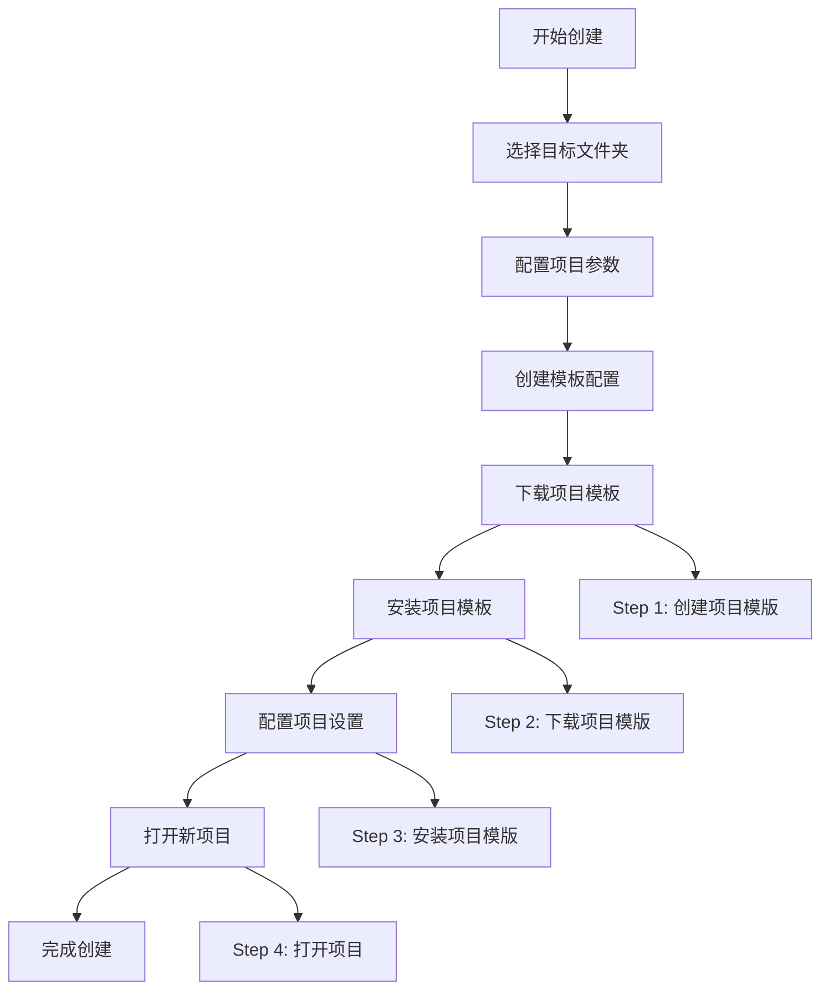

# 脚手架管理模块详解

## 模块概述

脚手架管理模块 (CliController) 提供了完整的项目脚手架创建和管理功能，集成了 Happy CLI 工具链，通过可视化界面简化了项目初始化流程。

## 核心功能

### 🔍 环境检测与管理

#### 环境检查功能
- **Node.js 版本检测**: 确保 Node.js 环境满足最低版本要求
- **CLI 工具状态**: 检查 Happy CLI 是否已正确安装
- **依赖完整性**: 验证相关依赖工具的可用性
- **环境报告**: 生成详细的环境状态报告

#### 技术实现
```typescript
@callable("checkEnvironment")
checkEnvironment(): Promise<any> {
  return new Promise((resolve, reject) => {
    // Node.js 版本检查
    const nodeVersionCheckResult = checkNodeVersion();
    console.log("nodeVersionCheckResult :>> ", nodeVersionCheckResult);
    
    // CLI 工具安装检查
    const cliInstalled = checkHappyCliInstalled();
    console.log("cliInstalled :>> ", cliInstalled);
    
    resolve({
      nodeVersionCheckResult,
      cliInstalled,
    });
  });
}
```

#### 环境检查工具
```typescript
// utils/happyCliUtils.ts
export function checkNodeVersion(): {
  installed: boolean;
  version?: string;
  meetRequirement: boolean;
} {
  try {
    const version = process.version;
    const majorVersion = parseInt(version.slice(1).split('.')[0]);
    
    return {
      installed: true,
      version: version,
      meetRequirement: majorVersion >= 14 // 最低要求 Node.js 14
    };
  } catch (error) {
    return {
      installed: false,
      meetRequirement: false
    };
  }
}

export function checkHappyCliInstalled(): {
  installed: boolean;
  version?: string;
} {
  try {
    // 检查 @happy.cli/cli 是否全局安装
    const result = execSync('npm list -g @happy.cli/cli --depth=0', { 
      encoding: 'utf8',
      stdio: 'pipe'
    });
    
    return {
      installed: true,
      version: extractVersionFromNpmList(result)
    };
  } catch (error) {
    return {
      installed: false
    };
  }
}
```

### 🏗️ 项目创建流程

#### 创建流程概览


#### 核心创建方法
```typescript
@callable("executeCli")
async executeCli(params: {
  name: string;
  type: string;
  template: any;
}): Promise<any> {
  const { name, type, template } = params;
  
  try {
    // Step 1: 选择目标文件夹
    const folder = await vscode.window.showOpenDialog({
      canSelectFolders: true,
      canSelectMany: false,
      openLabel: "请选择项目模版文件生成位置",
    });
    
    if (!folder) return;
    
    // 获取文件安装地址
    const baseDir = folder[0].fsPath;
    
    // Step 2: 创建模板配置
    const selectedTemplate = await createTemplateByOptions({
      name,
      type,
      template,
    });
    
    // Step 3: 创建项目模版 (通知进度)
    this.emitProcessStepUpdate(processStep.STEP1);
    await installTemplate(selectedTemplate, baseDir);
    
    // Step 4: 下载项目模版至缓存目录
    this.emitProcessStepUpdate(processStep.STEP2);
    await downloadTemplate(selectedTemplate);
    
    // Step 5: 安装项目模版至项目目录
    this.emitProcessStepUpdate(processStep.STEP3);
    await installTemplate(selectedTemplate, baseDir);
    
    // Step 6: 完成并打开项目
    this.emitProcessStepUpdate(processStep.STEP4);
    const projectPath = path.join(baseDir, name);
    
    // 打开新的项目窗口
    vscode.commands.executeCommand(
      "vscode.openFolder",
      vscode.Uri.file(projectPath),
      true
    );
    
    return true;
  } catch (error) {
    return Promise.reject(error);
  }
}
```

### 📦 模板管理系统

#### 模板配置创建
```typescript
// core/cli/createTemplateByOptions.ts
export async function createTemplateByOptions(options: {
  name: string;
  type: string;
  template: any;
}): Promise<TemplateConfig> {
  const { name, type, template } = options;
  
  return {
    name: name,
    type: type,
    template: {
      name: template.name,
      version: template.version || 'latest',
      registry: template.registry || 'npm',
      source: template.source,
      config: template.config || {}
    },
    targetPath: '',
    cachePath: getCachePath(template.name),
    metadata: {
      createdAt: new Date().toISOString(),
      author: template.author,
      description: template.description
    }
  };
}
```

#### 模板下载管理
```typescript
// core/cli/downloadTemplate.ts
export async function downloadTemplate(template: TemplateConfig): Promise<void> {
  const { template: templateInfo, cachePath } = template;
  
  try {
    // 检查缓存是否存在
    if (await pathExists(cachePath)) {
      console.log(`Template ${templateInfo.name} already cached`);
      return;
    }
    
    // 创建缓存目录
    await fs.ensureDir(cachePath);
    
    // 根据模板源类型下载
    switch (templateInfo.registry) {
      case 'npm':
        await downloadFromNpm(templateInfo, cachePath);
        break;
      case 'git':
        await downloadFromGit(templateInfo, cachePath);
        break;
      case 'local':
        await copyFromLocal(templateInfo, cachePath);
        break;
      default:
        throw new Error(`Unsupported registry type: ${templateInfo.registry}`);
    }
    
    console.log(`Template ${templateInfo.name} downloaded successfully`);
  } catch (error) {
    // 清理失败的下载
    await fs.remove(cachePath);
    throw error;
  }
}

async function downloadFromNpm(templateInfo: any, cachePath: string): Promise<void> {
  const packageName = templateInfo.source || templateInfo.name;
  const version = templateInfo.version || 'latest';
  
  // 使用 npm pack 下载包
  const command = `npm pack ${packageName}@${version}`;
  const result = await execa(command, { cwd: cachePath });
  
  // 解压下载的包
  const tarFile = result.stdout.trim();
  await execa('tar', ['-xzf', tarFile], { cwd: cachePath });
  
  // 清理 tar 文件
  await fs.remove(path.join(cachePath, tarFile));
}
```

#### 模板安装管理
```typescript
// core/cli/installTemplate.ts
export async function installTemplate(
  template: TemplateConfig, 
  targetDir: string
): Promise<void> {
  const { name, cachePath } = template;
  const projectPath = path.join(targetDir, name);
  
  try {
    // 确保目标目录不存在
    if (await pathExists(projectPath)) {
      throw new Error(`Project directory ${name} already exists`);
    }
    
    // 复制模板文件
    await fs.copy(cachePath, projectPath, {
      filter: (src, dest) => {
        // 过滤不需要的文件
        const relativePath = path.relative(cachePath, src);
        return !shouldIgnoreFile(relativePath);
      }
    });
    
    // 处理模板变量替换
    await processTemplateVariables(projectPath, template);
    
    // 更新 package.json
    await updatePackageJson(projectPath, template);
    
    console.log(`Template installed to ${projectPath}`);
  } catch (error) {
    // 清理失败的安装
    if (await pathExists(projectPath)) {
      await fs.remove(projectPath);
    }
    throw error;
  }
}

function shouldIgnoreFile(filePath: string): boolean {
  const ignorePatterns = [
    'node_modules',
    '.git',
    '.DS_Store',
    '*.log',
    '.env.local'
  ];
  
  return ignorePatterns.some(pattern => {
    return minimatch(filePath, pattern);
  });
}

async function processTemplateVariables(
  projectPath: string, 
  template: TemplateConfig
): Promise<void> {
  const variables = {
    PROJECT_NAME: template.name,
    PROJECT_TYPE: template.type,
    CREATED_DATE: new Date().toISOString(),
    ...template.template.config
  };
  
  // 查找所有模板文件
  const templateFiles = await glob('**/*.template', { cwd: projectPath });
  
  for (const templateFile of templateFiles) {
    const filePath = path.join(projectPath, templateFile);
    const content = await fs.readFile(filePath, 'utf8');
    
    // 替换变量
    const processedContent = ejs.render(content, variables);
    
    // 写入处理后的文件
    const outputPath = filePath.replace('.template', '');
    await fs.writeFile(outputPath, processedContent);
    
    // 删除模板文件
    await fs.remove(filePath);
  }
}
```

### 🔄 进度管理系统

#### 进度步骤定义
```typescript
// constants/cli.ts
export const processStep = {
  STEP1: {
    id: 1,
    name: "创建项目模版",
    description: "正在创建项目模版配置...",
    status: "pending"
  },
  STEP2: {
    id: 2,
    name: "下载项目模版",
    description: "正在从远程仓库下载模版...",
    status: "pending"
  },
  STEP3: {
    id: 3,
    name: "安装项目模版",
    description: "正在安装模版到目标目录...",
    status: "pending"
  },
  STEP4: {
    id: 4,
    name: "打开项目",
    description: "正在打开新创建的项目...",
    status: "pending"
  }
};
```

#### 进度通知机制
```typescript
@subscribable("processStepUpdate")
processStepUpdate(next: (data: any) => void) {
  this.subscribers.push(next);
  return () => {
    this.subscribers = this.subscribers.filter(cb => cb !== next);
  };
}

private subscribers: ((data: any) => void)[] = [];

private emitProcessStepUpdate(data: any) {
  this.subscribers.forEach(cb => cb(data));
}
```

#### 前端进度显示
```typescript
// React 组件中的进度处理
const CliTab = () => {
  const [currentStep, setCurrentStep] = useState(0);
  const [steps, setSteps] = useState(Object.values(processStep));
  
  useEffect(() => {
    const unsubscribe = subscribe('processStepUpdate', (stepData) => {
      setCurrentStep(stepData.id);
      setSteps(prevSteps => 
        prevSteps.map(step => 
          step.id === stepData.id 
            ? { ...step, status: 'active' }
            : step.id < stepData.id 
              ? { ...step, status: 'completed' }
              : step
        )
      );
    });
    
    return unsubscribe;
  }, []);
  
  return (
    <Steps current={currentStep} direction="vertical">
      {steps.map(step => (
        <Step
          key={step.id}
          title={step.name}
          description={step.description}
          status={step.status}
        />
      ))}
    </Steps>
  );
};
```

### 🛠️ CLI 工具管理

#### CLI 工具安装
```typescript
@callable("installHappyCli")
async installHappyCli() {
  return new Promise<boolean>((resolve, reject) => {
    const terminal = vscode.window.createTerminal("安装 Happy CLI");
    terminal.show();
    terminal.sendText("npm install -g @happy.cli/cli", true);
    resolve(true);
  });
}
```

#### 快速项目创建
```typescript
@callable("createHappyApp")
async createHappyApp(): Promise<any> {
  return new Promise((resolve, reject) => {
    const terminal = vscode.window.createTerminal("Create Happy App构建模版");
    terminal.show();
    terminal.sendText(
      "npx create-happy-app my-app --type project -p template-vue",
      true
    );
    resolve(true);
  });
}
```

## 模板系统架构

### 模板类型定义
```typescript
interface TemplateConfig {
  name: string;                    // 项目名称
  type: string;                    // 项目类型 (web, api, mobile, etc.)
  template: {
    name: string;                  // 模板名称
    version: string;               // 模板版本
    registry: 'npm' | 'git' | 'local'; // 模板来源
    source: string;                // 模板源地址
    config: Record<string, any>;   // 模板配置参数
  };
  targetPath: string;              // 目标安装路径
  cachePath: string;               // 缓存路径
  metadata: {
    createdAt: string;             // 创建时间
    author?: string;               // 作者信息
    description?: string;          // 描述信息
  };
}
```

### 支持的模板类型

#### Web 应用模板
- **Vue 3 + TypeScript**: 现代化 Vue.js 应用
- **React + TypeScript**: React 应用脚手架
- **Angular**: Angular 企业级应用
- **Vanilla JS**: 原生 JavaScript 应用

#### API 服务模板
- **Express + TypeScript**: Node.js API 服务
- **NestJS**: 企业级 Node.js 框架
- **Koa**: 轻量级 Node.js 框架
- **Fastify**: 高性能 Node.js 框架

#### 移动应用模板
- **React Native**: 跨平台移动应用
- **Flutter**: Google 跨平台框架
- **Ionic**: 混合移动应用

#### 工具库模板
- **TypeScript Library**: TypeScript 库模板
- **Node.js Package**: Node.js 包模板
- **VSCode Extension**: VSCode 扩展模板

## 缓存管理

### 缓存策略
```typescript
// 缓存路径管理
function getCachePath(templateName: string): string {
  const homeDir = os.homedir();
  const cacheDir = path.join(homeDir, '.happy-cli', 'templates');
  return path.join(cacheDir, templateName);
}

// 缓存清理
async function clearCache(templateName?: string): Promise<void> {
  const cacheDir = path.join(os.homedir(), '.happy-cli', 'templates');
  
  if (templateName) {
    // 清理特定模板缓存
    const templateCache = path.join(cacheDir, templateName);
    if (await pathExists(templateCache)) {
      await fs.remove(templateCache);
    }
  } else {
    // 清理所有缓存
    if (await pathExists(cacheDir)) {
      await fs.remove(cacheDir);
    }
  }
}

// 缓存大小统计
async function getCacheSize(): Promise<number> {
  const cacheDir = path.join(os.homedir(), '.happy-cli', 'templates');
  
  if (!await pathExists(cacheDir)) {
    return 0;
  }
  
  const files = await glob('**/*', { cwd: cacheDir });
  let totalSize = 0;
  
  for (const file of files) {
    const filePath = path.join(cacheDir, file);
    const stats = await fs.stat(filePath);
    if (stats.isFile()) {
      totalSize += stats.size;
    }
  }
  
  return totalSize;
}
```

## 错误处理和恢复

### 错误类型定义
```typescript
enum CliErrorType {
  ENVIRONMENT_ERROR = 'ENVIRONMENT_ERROR',
  TEMPLATE_NOT_FOUND = 'TEMPLATE_NOT_FOUND',
  DOWNLOAD_FAILED = 'DOWNLOAD_FAILED',
  INSTALL_FAILED = 'INSTALL_FAILED',
  PERMISSION_DENIED = 'PERMISSION_DENIED',
  NETWORK_ERROR = 'NETWORK_ERROR'
}

class CliError extends Error {
  constructor(
    public type: CliErrorType,
    message: string,
    public details?: any
  ) {
    super(message);
    this.name = 'CliError';
  }
}
```

### 错误处理策略
```typescript
async function handleCliError(error: CliError): Promise<void> {
  switch (error.type) {
    case CliErrorType.ENVIRONMENT_ERROR:
      // 显示环境配置指导
      await showEnvironmentSetupGuide();
      break;
      
    case CliErrorType.TEMPLATE_NOT_FOUND:
      // 显示可用模板列表
      await showAvailableTemplates();
      break;
      
    case CliErrorType.DOWNLOAD_FAILED:
      // 提供重试选项
      await offerRetryOption(error.details);
      break;
      
    case CliErrorType.INSTALL_FAILED:
      // 清理失败的安装并提供帮助
      await cleanupFailedInstall(error.details);
      break;
      
    case CliErrorType.PERMISSION_DENIED:
      // 显示权限解决方案
      await showPermissionSolution();
      break;
      
    case CliErrorType.NETWORK_ERROR:
      // 检查网络连接并提供离线选项
      await handleNetworkError();
      break;
      
    default:
      // 通用错误处理
      vscode.window.showErrorMessage(`CLI Error: ${error.message}`);
  }
}
```

## 性能优化

### 并发控制
```typescript
// 限制并发下载数量
const downloadQueue = new PQueue({ concurrency: 3 });

async function downloadMultipleTemplates(templates: TemplateConfig[]): Promise<void> {
  const downloadTasks = templates.map(template => 
    downloadQueue.add(() => downloadTemplate(template))
  );
  
  await Promise.all(downloadTasks);
}
```

### 增量更新
```typescript
// 检查模板是否需要更新
async function checkTemplateUpdate(template: TemplateConfig): Promise<boolean> {
  const cachePath = template.cachePath;
  const cacheMetaPath = path.join(cachePath, '.meta.json');
  
  if (!await pathExists(cacheMetaPath)) {
    return true; // 需要下载
  }
  
  const cacheMeta = await fs.readJson(cacheMetaPath);
  const remoteVersion = await getRemoteTemplateVersion(template);
  
  return cacheMeta.version !== remoteVersion;
}
```

## 测试和质量保证

### 单元测试
```typescript
// 测试环境检查功能
describe('CliController', () => {
  let controller: CliController;
  
  beforeEach(() => {
    controller = new CliController();
  });
  
  describe('checkEnvironment', () => {
    it('should return correct Node.js version info', async () => {
      const result = await controller.checkEnvironment();
      
      expect(result.nodeVersionCheckResult).toBeDefined();
      expect(result.nodeVersionCheckResult.installed).toBe(true);
      expect(result.nodeVersionCheckResult.version).toMatch(/^v\d+\.\d+\.\d+$/);
    });
    
    it('should detect CLI installation status', async () => {
      const result = await controller.checkEnvironment();
      
      expect(result.cliInstalled).toBeDefined();
      expect(typeof result.cliInstalled.installed).toBe('boolean');
    });
  });
});
```

### 集成测试
```typescript
// 测试完整的项目创建流程
describe('Project Creation Flow', () => {
  it('should create project successfully', async () => {
    const params = {
      name: 'test-project',
      type: 'web',
      template: {
        name: 'vue-typescript',
        version: 'latest'
      }
    };
    
    const result = await controller.executeCli(params);
    expect(result).toBe(true);
    
    // 验证项目文件是否创建
    const projectPath = path.join(testDir, params.name);
    expect(await pathExists(projectPath)).toBe(true);
    expect(await pathExists(path.join(projectPath, 'package.json'))).toBe(true);
  });
});
```

---

*本文档详细描述了脚手架管理模块的完整实现，包括环境检测、项目创建、模板管理、进度控制等核心功能的技术细节和最佳实践。*